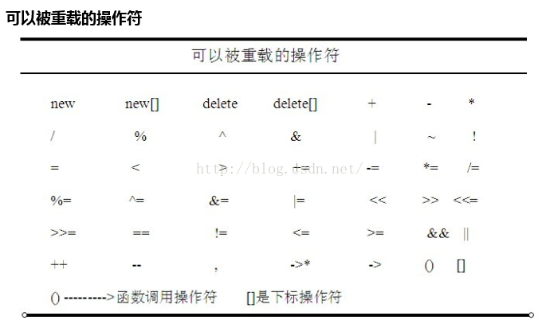
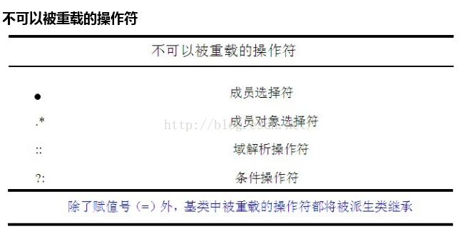

原文：[C++ operator关键字（重载操作符）](http://blog.csdn.net/my_heart_/article/details/51534624)

`operator`是C\+\+的关键字，它和运算符一起使用，表示一个运算符函数，理解时应将`operator=`整体上视为一个函数名。

### 为什么使用操作符重载？

对于系统的所有操作符，一般情况下，只支持基本数据类型和标准库中提供的`class`，对于用户自己定义`class`，如果想支持基本操作，比如比较大小，判断是否相等，等等，则需要用户自己来定义关于这个操作符的具体实现。

比如，判断两个人是否一样大，我们默认的规则是按照其年龄来比较，所以，在设计`person`这个`class`的时候，我们需要考虑操作符`==`，而且，根据刚才的分析，比较的依据应该是`age`。

那么为什么叫重载呢？这是因为，在编译器实现的时候，已经为我们提供了这个操作符的基本数据类型实现版本，但是现在他的操作数变成了用户定义的数据类型`class`，所以，需要用户自己来提供该参数版本的实现。

### 如何声明一个重载的操作符？

#### 操作符重载实现为类成员函数

重载的操作符在类体中被声明，声明方式如同普通成员函数一样，只不过他的名字包含关键字`operator`，以及紧跟其后的一个C\+\+预定义的操作符。

可以用如下的方式来声明一个预定义的`==`操作符:
```cpp
#include <iostream>
using namespace std;

class Person{
private:
    int age;
public:
    Person(int age):age(age){}
    inline bool operator==(const Person &p) const{
        return this->age == p.age;
    }
};

int main() {
    Person a(10),b(12);
    cout<<(a==b)<<endl;
    return 0;
}
```
因为`operator==`是`class person`的一个成员函数，所以对象`a,b`都可以调用该函数，`a==b`相当于`a`调用`operator==`，把`b`作为该函数的一个参数传递给该函数，从而实现了两个对象的比较。

#### 操作符重载实现为非类成员函数（全局函数）

对于全局重载操作符，代表左操作数的参数必须被显式指定。
```cpp
#include <iostream>
using namespace std;

class Person{
public:
    int age;
    Person(int age):age(age){}
};

inline bool operator==(const Person &a,const Person &b){
    return a.age == b.age;
}

int main() {
    Person a(10),b(12);
    cout<<(a==b)<<endl;
    return 0;
}
```
由于此处`operator==`是一个全局函数，故无法访问`class person`的私有成员，我们可以通过将`operator==`定义为`class person`的友元函数，来实现对`class person`的私有成员的访问。
```cpp
#include <iostream>
using namespace std;

class Person{
private:
    int age;
public:
    Person(int age):age(age){}
    friend inline bool operator==(const Person &a,const Person &b);
};

inline bool operator==(const Person &a,const Person &b){
    return a.age == b.age;
}

int main() {
    Person a(10),b(12);
    cout<<(a==b)<<endl;
    return 0;
}
```

#### 如何决定把一个操作符重载为类成员函数还是全局函数呢？

* 如果一个重载操作符是类成员，那么只有当与它的左操数是该类的对象时，该操作符才会被调用。如果该操作符的左操作数必须是其他的类型，则操作符必须被重载为全局函数
* C\+\+要求赋值`=`，下标`[]`，调用`()`，和成员指向`->`操作符必须被定义为类成员操作符
* 如果有一个操作数是类类型如string类的情形那么对于对称操作符比如等于操作符最好定义为全局函数

#### 操作符重载适用范围





#### 重载运算符的限制

1. 只有C\+\+预定义的操作符才可以被重载
2. 对于内置类型的操作符，它的预定义不能改变，即不能改变操作符原来的功能
3. 重载操作符不能改变他们的操作符优先级
4. 重载操作符不能改变操作数的个数
5. 除了对`()`操作符外，对其他重载操作符提供缺省实参都是非法的
