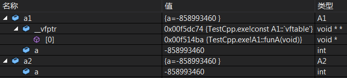
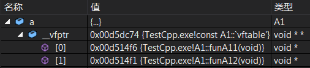
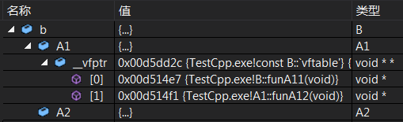
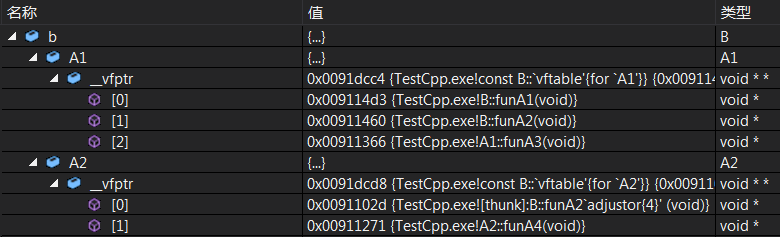

### 虚函数与虚函数表

在类中加了`virtual`关键字的成员函数就是虚函数。其中，友元函数、构造函数、静态成员函数不能用`virtual`关键字修饰。

```cpp
#include <iostream>
using namespace std;

class A1{
public:
    int a;
    virtual void funA(){
        cout << "A1::funA()" << endl;
    }
};

class A2{
public:
    int a;
    void funA(){
        cout << "A2::funA()" << endl;
    }
};

int main() {
    A1 a1;
    A1 *pa1 = &a1;
    A1 &aa1 = a1;
    cout << "sizeof(a1)=" << sizeof(a1) << endl;
    a1.funA();
    pa1->funA();
    aa1.funA();

    A2 a2;
    A2 *pa2 = &a2;
    A2 &aa2 = a2;
    cout << "sizeof(a2)=" << sizeof(a2) << endl;
    a2.funA();
    pa2->funA();
    aa2.funA();
    return 0;
}
```
运行结果：
```
sizeof(a1)=8
A1::funA()
A1::funA()
A1::funA()
sizeof(a2)=4
A2::funA()
A2::funA()
A2::funA()
```
通过下面反汇编结果可以看到，实例`a1`与`a2`都是通过函数指针完成函数的调用，所以并不存在效率降低问题。但我们也看到包含虚函数的`a1`所占内存比`a2`多4字节，虚函数跟普通成员函数一样都保存在代码区，根据下面的截图可以看到，这里多出的4个字节存放的是一个指向类`A1`虚函数表的指针，在虚函数表中存放着`A1`中所定义的虚函数。当通过指针或引用调用普通成员函数时，还是直接通过函数指针调用，而此时调用虚函数则是先通过存放在实例的指向虚函数表的指针找到虚函数表，再从虚函数表的确定位置处来获取函数指针，这样就降低了效率。

截图：



部分反汇编结果：
```cpp
...
25: 	a1.funA();
lea         ecx,[a1]
call        A1::funA (0BA150Fh)
26: 	pa1->funA();
mov         eax,dword ptr [pa1]
mov         edx,dword ptr [eax]
mov         esi,esp
mov         ecx,dword ptr [pa1]
mov         eax,dword ptr [edx]
call        eax
cmp         esi,esp
call        __RTC_CheckEsp (0BA1348h)
27: 	aa1.funA();
mov         eax,dword ptr [aa1]
mov         edx,dword ptr [eax]
mov         esi,esp
mov         ecx,dword ptr [aa1]
mov         eax,dword ptr [edx]
call        eax
cmp         esi,esp
call        __RTC_CheckEsp (0BA1348h)
...
33: 	a2.funA();
lea         ecx,[a2]
call        A2::funA (0BA153Ch)
34: 	pa2->funA();
mov         ecx,dword ptr [pa2]
call        A2::funA (0BA153Ch)
35: 	aa2.funA();
mov         ecx,dword ptr [aa2]
call        A2::funA (0BA153Ch)
...
```
由于虚函数指针存放在虚函数表中，我们可以通过存放在实例中的指向虚函数表的指针找到函数指针，这在一定程度上也破坏了类的封装性。当然，在下面代码中如果直接通过函数指针调用虚函数，函数体中`this`指针的使用会受到限制，可是通过上面的分析，我们知道也可以通过将实例`a`的地址转为类`B`的指针或将类`B`的引用实现对类`A`私有虚函数的直接调用。
```cpp
#include <iostream>
using namespace std;

class A{
public:
    int a;
private:
    virtual void funA1(){
        cout << "A::funA1()" << endl;
    }
    virtual void funA2(int a){
        this->a = a;
        cout << "A::funA2()" << endl;
    }
};

class B{
public:
    virtual void funB1(){
        cout << "B::funB1()" << endl;
    }
    virtual void funB2(int a){
        cout << "B::funB2()" << endl;
    }
};

int main() {
    A a;
    typedef void(*Fun)();
    Fun fun = (Fun)*(unsigned int *)*(unsigned int*)&a;
    fun();
    cout << "a.a=" << a.a << endl;
    ((B *)&a)->funB2(1);
    cout << "a.a=" << a.a << endl;
    ((B &)a).funB2(2);
    cout << "a.a=" << a.a << endl;
    return 0;
}
```
运行结果：
```
A::funA1()
a.a=2686868
A::funA2()
a.a=1
A::funA2()
a.a=2
```
C\+\+语言为我们提供了一种语法结构，通过它可以指明，一个虚函数只是提供了一个可被子类改写的接口。但是，它本身并不能通过虚拟机制被调用。这就是纯虚函数。含有（或继续）一个或多个纯虚函数的类是抽象基类，抽象基类不能实例化，一般用于继承。

**注意：** 纯虚函数也可以有函数体，但必须在类外声明，因为类内声明纯虚函数要以`=0;`结尾。不过为纯虚函数添加函数体完全没有必要，因为类依旧是抽象类，不能实例化，这不是一种好的设计方式。
```cpp
#include <iostream>
using namespace std;

class A{
public:
    virtual void funA() = 0;  // 纯虚函数
};

class B :public A{
public:
    virtual void funA(){
        cout << "B::funA()" << endl;
    }
};

int main() {
//    A a;  // 错误
    A &&a = B();
    a.funA();
    return 0;
}
```

### 覆盖与多态

在基类的派生类中可以通过重写虚函数来实现对基类虚函数的覆盖，我们已经知道，当通过类的指针或引用调用虚函数时，并不是直接通过函数指针，而是通过存放在实例的指向虚函数表的指针找到虚函数表，再从虚函数表的确定位置处来获取函数指针，这个位置在编译时就已经确定。所以，我们可以使用指向派生类实例的基类指针或引用调用派生类的重写虚函数，这是面向对象中的多态性的体现。若重写函数不是基类虚函数，此时调用的是基类成员函数。
```cpp
#include <iostream>
using namespace std;

class A1{
public:
    virtual void funA11(){
        cout << "A1::funA11()" << endl;
    }
    virtual void funA12(){
        cout << "A1::funA12()" << endl;
    }
};

class A2{
public:
    void funA21(){
        cout << "A2::funA21()" << endl;
    }
};

class B :public A1, public A2{
public:
    virtual void funA11(){
        cout << "B::funA11()" << endl;
    }
    virtual void funB1(){
        cout << "B::funB1()" << endl;
    }
    void funA21(){
        cout << "B::funA21()" << endl;
    }
};

int main() {
    B b; A1 a;
    A1 &a1 = b;
    A2 &a2 = b;
    a1.funA11();
    a1.A1::funA11();
    a1.funA12();
    a2.funA21();
    return 0;
}
```
运行结果：
```
B::funA11()
A1::funA11()
A1::funA12()
A2::funA21()
```
通过下面的截图，在父类`A1`实例`a`指向的虚函数表中存放着`A1`的虚函数指针，子类`B`重写了父类虚函数`A1::funA11()`，我们看到在类`B`实例`b`中父类`A1`拷贝所指向的虚函数表中的`A1::funA11()`被`B::funA11()`覆盖。虽然`A1`的虚函数在`B`中被覆盖，但在上面的代码中我们还是可以调用`A1::funA11()`，根据反汇编结果，此时直接通过函数指针调用而不是经过虚函数表。

截图：

 

部分反汇编结果：
```cpp
38: 	a1.funA11();
mov         eax,dword ptr [a1]
mov         edx,dword ptr [eax]
mov         esi,esp
mov         ecx,dword ptr [a1]
mov         eax,dword ptr [edx]
call        eax
cmp         esi,esp
call        __RTC_CheckEsp (0FA133Eh)
39: 	a1.A1::funA11();
mov         ecx,dword ptr [a1]
call        A1::funA11 (0FA14F6h)
40: 	a1.funA12();
mov         eax,dword ptr [a1]
mov         edx,dword ptr [eax]
mov         esi,esp
mov         ecx,dword ptr [a1]
mov         eax,dword ptr [edx+4]
call        eax
cmp         esi,esp
call        __RTC_CheckEsp (0FA133Eh)
41: 	a2.funA21();
mov         ecx,dword ptr [a2]
call        A2::funA21 (0FA14ECh)
```
若通过`new`申请子类对象并赋值给父类指针，则使用`delete`释放内存空间时，如果父类中的析构函数没有声明为虚函数，就不会调用子类的析构函数。所以如果想要利用类的多态，最好将析构函数声明为虚函数，以确保在销毁对象时所有析构函数都被执行。
```cpp
#include <iostream>
using namespace std;

class A1{
public:
    virtual ~A1(){
        cout << "A1::~A1()" << endl;
    }
};

class A2{
public:
    ~A2(){
        cout << "A2::~A2()" << endl;
    }
};

class B :public A1, public A2{
public:
    ~B(){
        cout << "B::~B()" << endl;
    }
};

int main() {
    {
        A2 &&a2 = B();
    }
    cout << endl;
    A1 *pa1 = new B();
    delete pa1;
    cout << endl;
    A2 *pa2 = new B();
    delete pa2;
    return 0;
}
```
运行结果：
```
B::~B()
A2::~A2()
A1::~A1()

B::~B()
A2::~A2()
A1::~A1()

A2::~A2()
```
当子类继承多个包含虚函数的父类时，子类实例中父类的拷贝按继承顺序存放，且每一个包含虚函数父类拷贝中都存放着一个指向各自父类虚函数表的指针。
```cpp
#include <iostream>
using namespace std;

class A1{
public:
	virtual void funA1(){
		cout << "A1::funA1()" << endl;
	}
	virtual void funA2(){
		cout << "A1::funA2()" << endl;
	}
	virtual void funA3(){
		cout << "A1::funA3()" << endl;
	}
};

class A2{
public:
	virtual void funA2(){
		cout << "A2::funA2()" << endl;
	}
	virtual void funA4(){
		cout << "A2::funA4()" << endl;
	}
};

class B :public A1, public A2{
public:
	virtual void funA1(){
		cout << "B::funA1()" << endl;
	}
	virtual void funA2(){
		cout << "B::funA2()" << endl;
	}
	virtual void funB(){
		cout << "B::funB()" << endl;
	}
};

int main() {
	B b;
	typedef void(*Fun)();
	unsigned int *tableA1 = (unsigned int *)*(unsigned int *)&b,
	        	 *tableA2 = (unsigned int *)*((unsigned int *)&b+1);
	((Fun)tableA1[0])();
	((Fun)tableA1[1])();
	((Fun)tableA1[2])();
	((Fun)tableA1[3])();
//	((Fun)tableA1[4])();  // 错误
	cout << endl;
	((Fun)tableA2[0])();
	((Fun)tableA2[1])();
//	((Fun)tableA2[2])();  // 错误
	return 0;
}
```
运行结果：
```
B::funA1()
B::funA2()
A1::funA3()
B::funB()

B::funA2()
A2::funA4()
```
根据代码和截图可以看到，在子类`B`中重写父类`A1`与`A2`的虚函数，会覆盖所有虚函数表中具有相同函数签名的虚函数指针；而若在子类`B`中定义新的虚函数，根据运行结果可以看到，新的虚函数指针存放在实例`b`中的第一个虚函数表末尾。

截图：



### 虚继承与虚基类

虚继承主要解决交叉继承带来的问题，子类虚继承的父类称为虚基类。
```cpp
#include <iostream>
using namespace std;

class A {
public:
	int a;
	virtual void fun() {}
};

class VB1 :virtual public A {};

class VB2 :virtual public A {};

class B1 :public A {};

class B2 :public A {};

class C1 :public VB1, public VB2 {};

class C2 :public B1, public B2{};

int main() {
	C1 c1; c1.VB1::a = 11; c1.VB2::a = 12;
	C2 c2; c2.B1::a = 21; c2.B2::a = 22;
	c1.fun();
	c1.VB1::fun();
	c1.VB2::fun();
//	c2.fun();  // 错误
	c2.B1::fun();
	c2.B2::fun();
	return 0;
}
```
在代码中，`VB1`与`VB2`虚继承自`A`，然后`C1`继承`VB1`与`VB2`，`B1`与`B2`继承自`A`，然后`C2`继承`B1`与`B2`，就是交叉继承的情况。在`main()`中，分别将实例`c1`与`c2`的成员变量`a`赋值，通过下面截图可以看到，实例`c1`只有一份`A`的拷贝，分别通过`VB1`与`VB2`给成员变量`a`赋不同值，`a`的值等于最后一次赋值；实例`c2`则有来自`B1`与`B2`的两份`A`的拷贝，分别通过`B1`与`B2`给成员变量`a`赋不同值，在`c2`中`B1`与`B2`中的`a`为不同值。

截图：

 

在普通继承中，子类与父类是“is a”的关系；在虚继承中，子类与虚基类是“has a”的关系，因此虚继承可以认为不是一种继承关系，而是一种组合的关系。不能因为虚继承有着继承这两个字就认为和普通继承的用法没什么不同。

在以下代码中，我们用父类`A`的别名`a2`引用普通继承的子类`B2`，也可以再将其强制转化回子类别名`b2`的引用；但当用父类`A`的别名`a1`引用虚继承的子类`B1`时，我们不可以直接再将其强制转化回子类别名`b1`的引用，而需要使用其他方法间接转化。
```cpp
#include <iostream>
using namespace std;

class A{
public:
	virtual void fun(){
		cout << "A::fun()" << endl;
	}
};

class B1 :virtual public A{
public:
	virtual void fun(){
		cout << "B1::fun()" << endl;
	}
};

class B2 :public A{
public:
	virtual void fun(){
		cout << "B2::fun()" << endl;
	}
};

int main() {
	A &&a1 = B1();
	a1.fun();
//	B1 &b1 = (B1&)(a1);  // 错误
//	b1.fun();
	B1 &b1 = *(B1*)(void*)&a1;
	b1.fun();

	A &&a2 = B2();
	a2.fun();
	B2 &b2 = (B2&)(a2);
	b2.fun();
	return 0;
}
```
运行结果：
```
B1::fun()
B1::fun()
B2::fun()
B2::fun()
```
虚继承也存在与普通继承相同的问题，即如果想要利用类的多态，最好将析构函数声明为虚函数，以确保在销毁对象时所有析构函数都被执行。
```cpp
#include <iostream>
using namespace std;

class A1{
public:
	virtual ~A1(){
		cout << "A1::~A1()" << endl;
	}
};

class A2{
public:
	~A2(){
		cout << "A2::~A2()" << endl;
	}
};

class B :virtual public A1, virtual public A2{
public:
	~B(){
		cout << "B::~B()" << endl;
	}
};

int main() {
		{
			A2 &&a2 = B();
		}
	cout << endl;
	A1 *pa1 = new B();
	delete pa1;
	cout << endl;
	A2 *pa2 = new B();
	delete pa2;
	return 0;
}
```
运行结果：
```
B::~B()
A2::~A2()
A1::~A1()

B::~B()
A2::~A2()
A1::~A1()

A2::~A2()
```

**参考链接**

[C++ 的Virtual的用法](http://www.cnblogs.com/Yogurshine/archive/2013/01/10/2855654.html)</br>
[浅析c++中virtual关键字](http://blog.csdn.net/djh512/article/details/8973606)</br>
[c++ 虚继承与继承的差异](http://blog.csdn.net/dqjyong/article/details/8029527)</br>
[C++ 虚函数表解析](http://blog.csdn.net/haoel/article/details/1948051/)
