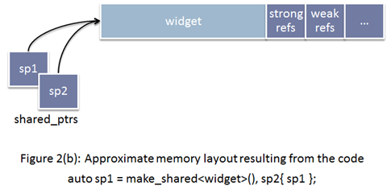

### make_unique的实现

`std::make_shared`是C\+\+11的一部分，但是`std::make_unique`很可惜不是。它是在C\+\+14里加入标准库的，但我们可以自己实现`make_unique`方法。
```cpp
// 支持普通指针
template<class T,class... Args> inline
typename enable_if<!is_array<T>::value,unique_ptr<T>>::type
make_unique(Args&&... args){
    return unique_ptr<T>(new T(std::forward<Args>(args)...));
}

// 支持动态数组
template<class T> inline
typename enable_if<is_array<T>::value && extent<T>::value == 0,unique_ptr<T>>::type
make_unique(size_t size){
    typedef typename remove_extent<T>::type U;
    return unique_ptr<T>(new U[size]());
}

// 过滤掉定长数组的情况
template<class T,class... Args>
typename enable_if<extent<T>::value != 0,void>::type
make_unique(Args&&...) = delete;
```
**enable_if的作用**
```cpp
// Primary template.
/// Define a member typedef @c type only if a boolean constant is true.
template<bool, typename _Tp = void>
  struct enable_if
  { };

// Partial specialization for true.
template<typename _Tp>
  struct enable_if<true, _Tp>
  { typedef _Tp type; };
```
结合源码可知，当`condition==true`时，`enable_if<condition,T>::type ≡ T`，否则报错。

* `enable_if<!is_array<T>::value,unique_ptr<T>>::type`的`condition`在`T`不是数组类型时为`true`
* `enable_if<is_array<T>::value && extent<T>::value == 0,unique_ptr<T>>::type`的`condition`在`T`为数组类型且数组中元素个数为0时为`true`，由于对于非数组类型`extent<U>::value`也为0，语句`is_array<T>::value`是必要的
* `enable_if<extent<T>::value != 0,void>::type`的`condition`在`T`类型中元素个数不为0时为`true`，即`T`为定长数组

**std::forward的作用**

`std::forward`在这里的作用是实现参数的完美转发，具体见[《move和forward源码分析[转]》](move和forward源码分析[转].md)。

### make函数的好处

**1. 效率更高**

`shared_ptr`需要维护引用计数的信息。如果你通过使用原始的`new`表达式分配对象，然后传递给`shared_ptr`（也就是使用`shared_ptr`的构造函数）的话，`shared_ptr`的实现没有办法选择，而只能单独的分配控制块：


如果选择使用`make_shared`的话，情况就会变成下面这样：



内存分配的动作，可以一次性完成。这减少了内存分配的次数，而内存分配是代价很高的操作。

**2. 异常安全**

看看下面的代码：
```cpp
void F(const std::shared_ptr<Lhs>& lhs, const std::shared_ptr<Rhs>& rhs) { /* ... */ }

F(std::shared_ptr<Lhs>(new Lhs("foo")),
  std::shared_ptr<Rhs>(new Rhs("bar")));
```
C\+\+是不保证参数求值顺序，以及内部表达式的求值顺序的，所以可能的执行顺序如下：

1. `new Lhs(“foo”))`
2. `new Rhs(“bar”))`
3. `std::shared_ptr`
4. `std::shared_ptr`

假设在第2步的时候，抛出了一个异常（比如out of memory，总之，`Rhs`的构造函数异常了），那么第一步申请的`Lhs`对象内存泄露了。这个问题的核心在于，`shared_ptr`没有立即获得裸指针。

我们可以用如下方式来修复这个问题：
```cpp
auto lhs = std::shared_ptr<Lhs>(new Lhs("foo"));
auto rhs = std::shared_ptr<Rhs>(new Rhs("bar"));
F(lhs, rhs);
```
当然，推荐的做法是使用`std::make_shared`来代替：
```cpp
F(std::make_shared<Lhs>("foo"), std::make_shared<Rhs>("bar"));
```
当`std::make_shared`被调用，指向动态内存对象的原始指针会被安全的保存在返回的`std::shared_ptr`对象中，然后另一`std::make_shared`被调用。如果此时产生了异常，那`std::shared_ptr`析构会知道于是它所拥有的对象会被销毁。

使用`std::make_unique`来代替`new`在写异常安全的代码里和使用`std::make_shared`一样重要。

### make函数的不足

1. `make`函数都不允许使用定制删除器，但是`std::unique_ptr`和`std::shared_ptr`的构造函数都可以。
2. `make`函数不能完美传递一个`initializer_list`。
替代方案：
```cpp
// initializer_list<int> aa = {1,2,3}; // 或者
auto aa = {1,2,3};
auto a = make_shared<vector<int>>(aa);
// auto b = make_shared<vector<int>>({1,2,3}); // 错误
```
3. 虽然使用`std::make_shared`可以减少了内存分配的次数，提高效率，但由于控制块与对象都在同一块动态分配的内存上，所以当对象的引用计数变为0，对象被销毁（析构函数被调），该对象所占内存仍未释放，直到控制块同样也被销毁，内存才会释放。

**参考链接**

[c++11 条款21：尽量使用std::make_unique和std::make_shared而不直接使用new](http://blog.csdn.net/coolmeme/article/details/43405155)</br>
[Why Make_shared ?](http://bitdewy.github.io/blog/2014/01/12/why-make-shared/)</br>
[通过new和make_shared构造shared_ptr的性能差异](http://www.cnblogs.com/egmkang/archive/2013/04/28/3049102.html)
