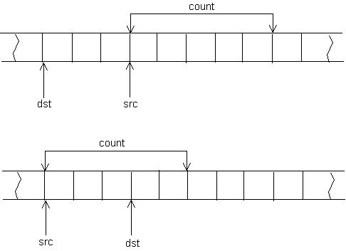

`memcpy`与`memmove`的目的都是将`N`个字节的源内存地址的内容拷贝到目标内存地址中。

但当源内存和目标内存存在重叠时，`memcpy`不保证拷贝结果的正确，而`memmove`能正确地实施拷贝，但这也增加了一点点开销。

`memcpy`的实现：
1. 当源内存的首地址等于目标内存的首地址时，不进行任何拷贝
2. 当源内存的首地址不等于目标内存的首地址时，实行正向拷贝

`memmove`的实现：
1. 当源内存的首地址等于目标内存的首地址时，不进行任何拷贝
2. 当源内存的首地址大于目标内存的首地址时，实行正向拷贝
3. 当源内存的首地址小于目标内存的首地址时，实行反向拷贝



当拷贝的区域重叠时，若源内存的首地址大于目标内存的首地址，则使用`memcpy`与`memmove`拷贝重叠的区域都不会出现问题，内容均可以正确的被拷贝；若源内存的首地址小于目标内存的首地址，则使用`memcpy`时，源内存中末尾字节内容会被覆盖，导致最后拷贝到目标内存的是已经被覆盖的内容。

```cpp
551 #ifndef __HAVE_ARCH_MEMCPY
552 /**
553  * memcpy - Copy one area of memory to another
554  * @dest: Where to copy to
555  * @src: Where to copy from
556  * @count: The size of the area.
557  *
558  * You should not use this function to access IO space, use memcpy_toio()
559  * or memcpy_fromio() instead.
560  */
561 void *memcpy(void *dest, const void *src, size_t count)
562 {
563         char *tmp = dest;
564         const char *s = src;
565
566         while (count--)
567                 *tmp++ = *s++;
568         return dest;
569 }
570 EXPORT_SYMBOL(memcpy);
571 #endif
572
573 #ifndef __HAVE_ARCH_MEMMOVE
574 /**
575  * memmove - Copy one area of memory to another
576  * @dest: Where to copy to
577  * @src: Where to copy from
578  * @count: The size of the area.
579  *
580  * Unlike memcpy(), memmove() copes with overlapping areas.
581  */
582 void *memmove(void *dest, const void *src, size_t count)
583 {
584         char *tmp;
585         const char *s;
586
587         if (dest <= src) {
588                 tmp = dest;
589                 s = src;
590                 while (count--)
591                         *tmp++ = *s++;
592         } else {
593                 tmp = dest;
594                 tmp += count;
595                 s = src;
596                 s += count;
597                 while (count--)
598                         *--tmp = *--s;
599         }
600         return dest;
601 }
602 EXPORT_SYMBOL(memmove);
603 #endif
```

**参考链接**

[memcpy memmove区别和实现](http://blog.csdn.net/hanchaoman/article/details/7937224)</br>
[memmove 和 memcpy的区别](http://blog.chinaunix.net/uid-26495963-id-3080058.html)</br>
[C/C++ memmove与memcpy的区别及实现](http://www.cnblogs.com/lyl-312/p/5514988.html)</br>
[linux内核中memcpy和memmove函数的区别和实现](http://blog.csdn.net/ce123_zhouwei/article/details/9002276)
