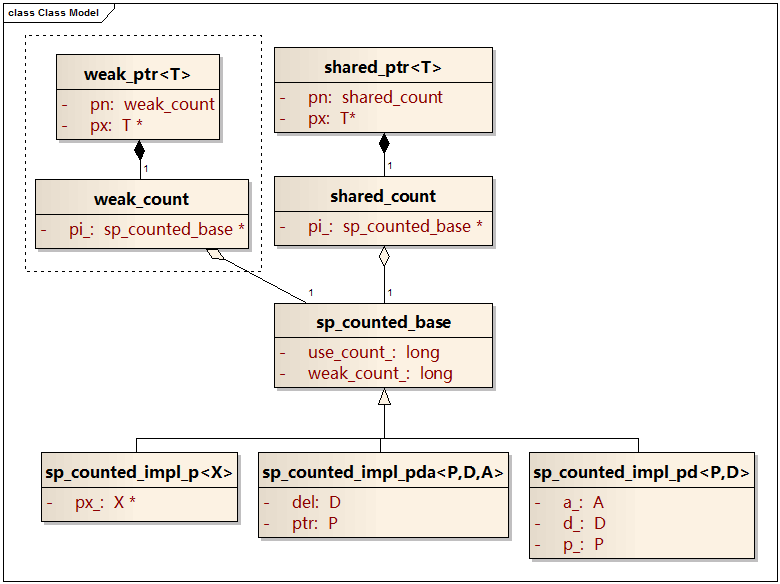
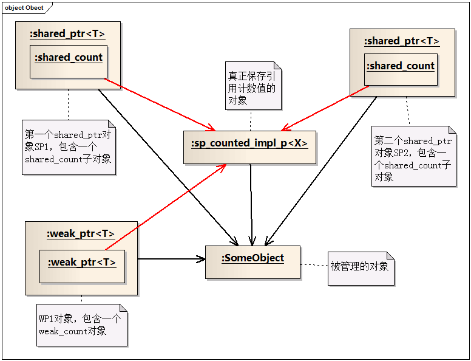

原文：[shared_ptr线程安全性分析](http://blog.csdn.net/jiangfuqiang/article/details/8292906)

本文基于`shared_ptr`的源代码，提取了`shared_ptr`的类图和对象图，然后分析了`shared_ptr`如何保证文档所宣称的线程安全性。本文的分析基于boost 1.52版本，编译器是VC 2010。

### `shared_ptr`的线程安全性

boost官方文档对`shared_ptr`线程安全性的正式表述是：`shared_ptr`对象提供与内置类型相同级别的线程安全性。

1. 同一个`shared_ptr`对象可以被多线程同时读取
2. 不同的`shared_ptr`对象可以被多线程同时修改（即使这些`shared_ptr`对象管理着同一个对象的指针）
3. 任何其他并发访问的结果都是无定义的

第一种情况是对对象的并发读，自然是线程安全的。

第二种情况下，如果两个`shared_ptr`对象`A`和`B`管理的是不同对象的指针，则这两个对象完全不相关，支持并发写也容易理解。但如果`A`和`B`管理的是同一个对象`P`的指针，则`A`和`B`需要维护一块共享的内存区域，该区域记录`P`指针当前的引用计数。对`A`和`B`的并发写必然涉及对该引用计数内存区的并发修改，这需要boost做额外的工作，也是本文分析的重点。

另外`weak_ptr`和`shared_ptr`紧密相关，用户可以从`weak_ptr`构造出`shared_ptr`，也可以从`shared_ptr`构造`weak_ptr`，但是`weak_ptr`不涉及到对象的生命周期。由于`shared_ptr`的线程安全性是和`weak_ptr`耦合在一起的，本文的分析也涉及到`weak_ptr`。

### `shared_ptr`的结构图

以下是从boost源码提取出的`shared_ptr`和`weak_ptr`的类图。



我们首先忽略虚线框内的`weak_ptr`部分。最高层的`shared_ptr`就是用户直接使用的类，它提供`shared_ptr`的构造、复制、重置（`reset`函数）、解引用、比较、隐式转换为`bool`等功能。它包含一个指向被管理对象的指针，用来实现解引用操作，并且组合了一个`shared_count`对象，用来操作引用计数。

但`shared_count`类还不是引用计数类，它只是包含了一个指向引用计数类`sp_counted_base`的指针，功能上是对`sp_counted_base`操作的封装。`shared_count`对象的创建、复制和删除等操作，包含着对`sp_counted_base`的增加和减小引用计数的操作。

最后`sp_counted_base`类才保存了引用计数，并且对引用计数字段提供无锁保护。它也包含了一个指向被管理对象的指针，是用来删除被管理的对象的。`sp_counted_base`有三个派生类，分别处理用户指定`Deleter`和`Allocator`的情况：

1. `sp_counted_impl_p`：用户没有指定`Deleter`和`Allocator`
2. `sp_counted_impl_pd`：用户指定了`Deleter`，没有指定`Allocator`
3. `sp_counted_impl_pda`：用户指定了`Deleter`和`Allocator`

创建指针`P`的第一个`shared_ptr`对象的时候，子对象`shared_count`同时被建立，`shared_count`根据用户提供的参数选择创建一个特定的`sp_counted_base`派生类对象`X`。之后创建的所有管理`P`的`shared_ptr`对象都指向了这个独一无二的`X`。

然后再看虚线框内的`weak_ptr`就清楚了。`weak_ptr`和`shared_ptr`基本上类似，只不过`weak_ptr`包含的是`weak_count`子对象，但`weak_count`和`shared_count`也都指向了`sp_counted_base`。
```cpp
shared_ptr<SomeObject> SP1(new SomeObject());
shared_ptr<SomeObject> SP2=SP1;
weak_ptr<SomeObject> WP1=SP1;
```
执行完以上代码后，内存中会创建以下对象实例，其中红色箭头表示指向引用计数对象的指针，黑色箭头表示指向被管理对象的指针。



从上面可以清楚的看出，`SP1`、`SP2`和`WP1`指向了同一个`sp_counted_impl_p`对象，这个`sp_counted_impl_p`对象保存引用计数，是`SP1`、`SP2`和`WP1`等三个对象共同操作的内存区。多线程并发修改`SP1`、`SP2`和`WP1`，有且只有`sp_counted_impl_p`对象会被并发修改，因此`sp_counted_impl_p`的线程安全性是`shared_ptr`以及`weak_ptr`线程安全性的关键问题。而`sp_counted_impl_p`的线程安全性是在其基类`sp_counted_base`中实现的。下面将着重分析`sp_counted_base`的代码。

### 引用计数类`sp_counted_base`

`sp_counted_base`的代码量很小，下面全文列出来，并添加有注释。
```cpp
class sp_counted_base {
private:
     // 禁止复制
    sp_counted_base(sp_counted_base const &);
    sp_counted_base & operator= (sp_counted_baseconst &);
    // shared_ptr的数量
    long use_count_;
    // weak_ptr的数量+1
    long weak_count_;
public:
    // 唯一的一个构造函数，注意这里把两个计数都置为1
    sp_counted_base(): use_count_(1), weak_count_(1){}
    // 虚基类，因此可以作为基类
    virtual ~sp_counted_base(){}
    // 子类需要重载，用operator delete或者Deleter删除被管理的对象
    virtual void dispose() = 0;
    // 子类可以重载，用Allocator等删除当前对象
    virtual void destroy() {
        delete this;
    }
    virtual void * get_deleter(sp_typeinfo const & ti) = 0;
    // 这个函数在根据shared_count复制shared_count的时候用到
    // 既然存在一个shared_count作为源，记为A，则只要A不释放，
    // use_count_就不会被另一个线程release()为1。
    // 另外，如果一个线程把A作为复制源，另一个线程释放A，执行结果是未定义的。
    void add_ref_copy() {
        _InterlockedIncrement(&use_count_);
    }
    // 这个函数在根据weak_count构造shared_count的时候用到
    // 这是为了避免通过weak_count增加引用计数的时候，
    // 另外的线程却调用了release函数，清零use_count_并释放了指向的对象
    bool add_ref_lock() {
        for(;;) {
            long tmp = static_cast<long const volatile&>(use_count_);
            if(tmp == 0) return false;
            if(_InterlockedCompareExchange(&use_count_, tmp + 1, tmp) == tmp) return true;
        }
    }
    void release(){
        if(_InterlockedDecrement(&use_count_) == 0) {
            // use_count_从1变成0的时候，
            // 1. 释放对象
            // 2. 对weak_count_执行一次递减操作。这是因为在初始化的时候（use_count_从0变1时），weak_count初始值为1
            dispose();
            weak_release();
        }
    }
    void weak_add_ref() {
        _InterlockedIncrement(&weak_count_);
    }
    // 递减weak_count_；且在weak_count为0的时候，把自己删除
    void weak_release() {
        if(_InterlockedDecrement(&weak_count_) == 0) {
            destroy();
        }
    }
    // 返回引用计数。注意如果用户没有额外加锁，引用计数完全可能同时被另外的线程修改掉。
    long use_count() const{
        return static_cast<long const volatile &>(use_count_);
    }
};
```
代码中的注释已经说明了一些问题，这里再重复一点：`use_count_`字段等于当前`shared_ptr`对象的数量，`weak_count_`字段等于当前`weak_ptr`对象的数量加1。

首先不考虑`weak_ptr`的情况。根据对`shared_ptr`类的代码分析（代码没有列出来，但很容易找到），`shared_ptr`之间的复制都是调用`add_ref_copy`和`release`函数进行的。假设两个线程分别对`SP1`和`SP2`进行操作，操作的过程无非是以下三种情况：

1. `SP1`和`SP2`都递增引用计数，即`add_ref_copy`被并发调用，也就是两个`_InterlockedIncrement(&use_count_)`并发执行，这是线程安全的。
2. `SP1`和`SP2`都递减引用计数，即`release`被并发调用，也就是`_InterlockedDecrement(&use_count_)`并发执行，这也是线程安全的。只不过后执行的线程负责删除对象。
3. `SP1`递增引用计数，调用`add_ref_copy`；`SP2`递减引用计数，调用`release`。由于`SP1`的存在，`SP2`的`release`操作无论如何都不会导致`use_count_`变为零，也就是说`release`中`if`语句的`body`永远不会被执行。因此，这种情况就化简为`_InterlockedIncrement(&use_count_)`和`_InterlockedDecrement(&use_count_)`的并发执行，仍然是线程安全的。

然后考虑`weak_ptr`。如果是`weak_ptr`之间的操作，或者从`shared_ptr`构造`weak_ptr`，都不涉及到`use_count_`的操作，只需要调用`weak_add_ref`和`weak_release`来操作`weak_count_`。与上面的分析相同，`_InterlockedIncrement`和`_InterlockedDecrement`保证了`weak_add_ref`和`weak_release`并发操作的线程安全性。

但如果存在从`weak_ptr`构造`shared_ptr`的操作，则需要考虑在构造`weak_ptr`的过程中，被管理的对象已经被其他线程被释放的情况。如果从`weak_ptr`构造`shared_ptr`仍然是通过`add_ref_copy`函数完成的，则可能发生以下错误情况：

|  | 线程1，从`weak_ptr`创建`shared_ptr` | 线程2，释放目前唯一存在的`shared_ptr` |
| -- | -- | -- |
| 1 | 判断`use_count_`大于0，等待执行`add_ref_copy` | |
| 2 | | 调用`release`，`use_count--`。发现`use_count`为0，删除被管理的对象 |
| 3 | 开始执行`add_ref_copy`，导致`use_count`递增。发生错误，`use_count==1`，但是对象已经被删除了 | |

我们自然会想，线程1在第三行结束后，再判断一次`use_count`是否为1，如果是1，认为对象已经删除，判断失败不就可以了吗。其实是行不通的，下面是一个反例。

|  | 线程1，从`weak_ptr`创建`shared_ptr` | 线程2，释放目前唯一存在的`shared_ptr` | 线程3，从`weak_ptr`创建`shared_ptr` |
| -- | -- | -- | -- |
| 1 | 判断`use_count_`大于0，等待执行`add_ref_copy` | | |
| 2 | | | 判断`use_count_`大于0，等待执行`add_ref_copy` |
| 3 | | 调用`release`，`use_count--`。发现`use_count`为0，删除被管理的对象 | |
| 4 | 开始执行`add_ref_copy`，导致`use_count`递增 | | |
| 5 | | | 执行`add_ref_copy`，导致`use_count`递增 |
| 6 | 发现`use_count_ != 1`，判断执行成功。发生错误，`use_count==2`，但是对象已经被删除了 | | 发现`use_count_ != 1`，判断执行成功。发生错误，`use_count==2`，但是对象已经被删除了 |

实际上，boost从`weak_ptr`构造`shared_ptr`不是调用`add_ref_copy`，而是调用`add_ref_lock`函数。`add_ref_lock`是典型的无锁修改共享变量的代码，下面再把它的代码复制一遍，并添加证明注释。
```cpp
bool add_ref_lock() {
  for(;;) {
    // 第一步，记录下use_count_
    long tmp = static_cast<long const volatile&>(use_count_);
    // 第二步，如果已经被别的线程抢先清0了，则被管理的对象已经或者将要被释放，返回false
    if(tmp == 0) return false;
    // 第三步，如果if条件执行成功，
    // 说明在修改use_count_之前,use_count仍然是tmp，大于0
    // 也就是说use_count_在第一步和第三步之间，从来没有变为0过
    // 这是因为use_count一旦变为0，就不可能再次累加为大于0
    // 因此，第一步和第三步之间，被管理的对象不可能被释放，返回true。
    if(_InterlockedCompareExchange(&use_count_, tmp + 1, tmp) == tmp) return true;
  }
}
```
在上面的注释中，用到了一个没有被证明的结论，“`use_count`一旦变为0，就不可能再次累加为大于0”。下面四条可以证明它：

1. `use_count_`是`sp_counted_base`类的`private`对象，`sp_counted_base`也没有友元函数，因此`use_count_`不会被对象外的代码修改
2. 成员函数`add_ref_copy`可以递增`use_count_`，但是所有对`add_ref_copy`函数的调用都是通过一个`shared_ptr`对象执行的。既然存在`shared_ptr`对象，`use_count`在递增之前一定不是0
3. 成员函数`add_ref_lock`可以递增`use_count_`，但正如`add_ref_lock`代码所示，执行第三步的时候，`tmp`都是大于0的，因此`add_ref_lock`不会使`use_count_`从0递增到1
4. 其它成员函数从来不会递增`use_count_`

至此，我们可以放下心来，只要`add_ref_lock`返回`true`，递增引用计数的行为就是成功的。因此从`weak_ptr`构造`shared_ptr`的行为也是完全确定的，要么`add_ref_lock`返回`true`，构造成功，要么`add_ref_lock`返回`false`，构造失败。

综上所述，多线程通过不同的`shared_ptr`或者`weak_ptr`对象并发修改同一个引用计数对象`sp_counted_base`是线程安全的。而`sp_counted_base`对象是这些智能指针唯一操作的共享内存区，因此最终的结果就是线程安全的。

### 总结

正如boost文档所宣称的，boost为`shared_ptr`提供了与内置类型同级别的线程安全性。这包括：

1. 同一个`shared_ptr`对象可以被多线程同时读取。
2. 不同的`shared_ptr`对象可以被多线程同时修改。
3. 同一个`shared_ptr`对象不能被多线程直接修改，但可以通过原子函数完成。
