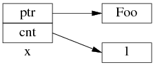
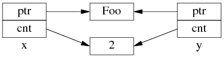
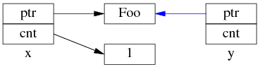
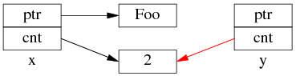
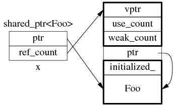

原文：[为什么多线程读写 shared_ptr 要加锁？](http://blog.csdn.net/solstice/article/details/8547547)

`shared_ptr`的引用计数本身是安全且无锁的，但对象的读写则不是，因为`shared_ptr`有两个数据成员，读写操作不能原子化。`shared_ptr`的线程安全级别和内建类型、标准库容器、`std::string`一样，即：

1. 一个`shared_ptr`对象实体可被多个线程同时读取
2. 两个`shared_ptr`对象实体可以被两个线程同时写入
3. 如果要从多个线程读写同一个`shared_ptr`对象，那么需要加锁

请注意，以上是`shared_ptr`对象本身的线程安全级别，不是它管理的对象的线程安全级别。

### `shared_ptr`的数据结构

`shared_ptr`是引用计数型（reference counting）智能指针，几乎所有的实现都采用在堆（heap）上放个计数值（count）的办法（除此之外理论上还有用循环链表的办法，不过没有实例）。具体来说，`shared_ptr<Foo>`包含两个成员，一个是指向`Foo`的指针`ptr`，另一个是`ref_count`指针（其类型不一定是原始指针，有可能是`class`类型，但不影响这里的讨论），指向堆上的`ref_count`对象。`ref_count`对象有多个成员，具体的数据结构如图所示，其中`deleter`和`allocator`是可选的。


为了简化并突出重点，后文只画出`use_count`的值：



以上是`shared_ptr<Foo> x(new Foo);`对应的内存数据结构。

如果再执行`shared_ptr<Foo> y = x;`那么对应的数据结构如下：



但是`y=x`涉及两个成员的复制，这两步拷贝不会同时（原子）发生。

* 步骤1：复制`ptr`指针：



* 步骤2：复制`ref_count`指针，导致引用计数加1：



步骤1和步骤2的先后顺序跟实现相关（因此步骤2里没有画出`y.ptr`的指向），我见过的都是先1后2。

既然`y=x`有两个步骤，如果没有`mutex`保护，那么在多线程里就有race condition。

### 多线程无保护读写`shared_ptr`可能出现的race condition

考虑一个简单的场景，有3个`shared_ptr<Foo>`对象`x,g,n`：
```cpp
shared_ptr<Foo> g(new Foo); // 线程之间共享的 shared_ptr
shared_ptr<Foo> x;          // 线程 A 的局部变量
shared_ptr<Foo> n(new Foo); // 线程 B 的局部变量
```


线程A执行`x = g;`（即read g），以下完成了步骤1，还没来及执行步骤2。这时切换到了B线程。


同时线程B执行`g = n;`（即write g），两个步骤一起完成了。

先是步骤1：


再是步骤2：


这是`Foo1`对象已经销毁，`x.ptr`成了空悬指针！

最后回到线程A，完成步骤2：


多线程无保护地读写`g`，造成了`x`是空悬指针的后果。这正是多线程读写同一个`shared_ptr`必须加锁的原因。

当然，race condition远不止这一种，其他线程交织（interweaving）有可能会造成其他错误。

### 其他

**1. 为什么`ref_count`也有指向`Foo`的指针？**

`shared_ptr<Foo> sp(new Foo)`在构造`sp`的时候捕获了`Foo`的析构行为。实际上`shared_ptr.ptr`和`ref_count.ptr`可以是不同的类型（只要它们之间存在隐式转换），这是`shared_ptr`的一大功能。分3点来说：

1）无需虚析构。假设`Bar`是`Foo`的基类，但是`Bar`和`Foo`都没有虚析构。
```cpp
shared_ptr<Foo> sp1(new Foo); // ref_count.ptr的类型是Foo*
shared_ptr<Bar> sp2 = sp1; // 可以赋值，自动向上转型（up-cast）
sp1.reset(); // 这时Foo对象的引用计数降为1
```
此后`sp2`仍然能安全地管理`Foo`对象的生命期，并安全完整地释放`Foo`，因为其`ref_count`记住了`Foo`的实际类型。

2）`shared_ptr<void>`可以指向并安全地管理（析构或防止析构）任何对象。
```cpp
shared_ptr<Foo> sp1(new Foo); // ref_count.ptr的类型是Foo*
shared_ptr<void> sp2 = sp1; // 可以赋值，Foo*向void*自动转型
sp1.reset(); // 这时Foo对象的引用计数降为1
```
此后`sp2`仍然能安全地管理`Foo`对象的生命期，并安全完整地释放`Foo`，不会出现`delete void*`的情况，因为`delete`的是`ref_count.ptr`，不是`sp2.ptr`。

3）多继承。假设`Bar`是`Foo`的多个基类之一，那么：
```cpp
shared_ptr<Foo> sp1(new Foo);
shared_ptr<Bar> sp2 = sp1; // 这时sp1.ptr和sp2.ptr可能指向不同的地址，因为Bar subobject在Foo object中的offset可能不为0。
sp1.reset(); // 此时Foo对象的引用计数降为1
```
但是`sp2`仍然能安全地管理`Foo`对象的生命期，并安全完整地释放`Foo`，因为`delete`的不是`Bar*`，而是原来的`Foo*`。换句话说，`sp2.ptr`和`ref_count.ptr`可能具有不同的值（当然它们的类型也不同）。

**2. 为什么要尽量使用`make_shared()`？**

为了节省一次内存分配，原来`shared_ptr<Foo> x(new Foo);`需要为`Foo`和`ref_count`各分配一次内存，现在用`make_shared()`的话，可以一次分配一块足够大的内存，供`Foo`和`ref_count`对象容身。数据结构是：



不过`Foo`的构造函数参数要传给`make_shared()`，后者再传给`Foo::Foo()`，这只有在C\+\+11里通过perfect forwarding才能完美解决。
