**第1步：** 选择File->New->CCS Project，输入工程名为test，点击Next

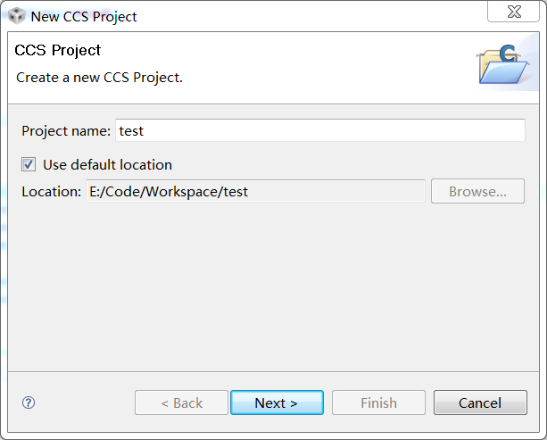

**第2步：** 由于芯片型号为C6455，选择Project Type为C6000系列，点击Next

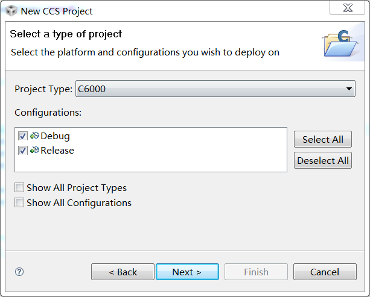

**第3步：** 选择存在相依性的工程。由于现在新建的工程是独立的，此步可跳过，直接Next

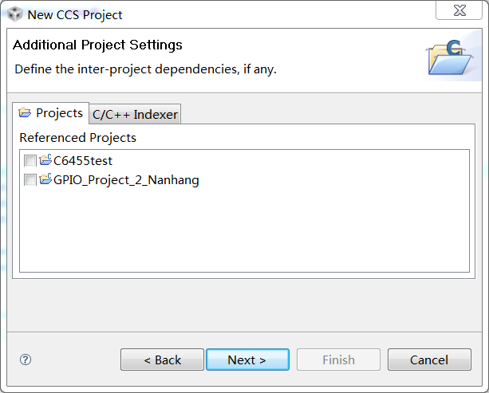

**第4步：** 设置工程的相关属性：具体的芯片类型，大小端模式，Code Generation Tools，输出文件类，C语言运行库等等
1)	**Device Variant：** C6000系列下面也有很多子系列，这个很好理解
2)	**Device Endianness：** 编程的人都知道什么是大小端，小端模式比较常用。这里要注意的就是大小端模式一定要和后面的C语言运行库对应上。对我而言即**rts64plus.lib**。一般来说，小端模式的运行库是**rtsxxxx.lib**，大端模式的C运行库命名为**rtsxxxxe.lib**，这一点一定要注意
3)	**Code Generation Tools：** 如果是在CCS4.2中导入CCS3.3的工程，那么编译的时候很有可能报关于Code Generation Tools相关的错误，很大的可能就是CCS3.3的工程使用的Code Generation Tools的版本在CCS4.2中没有安装，那么只需要右击工程，选择Properties，然后把对应的Code Generation Tools的版本改成当前CCS支持的版本即可
4)	**输出文件类型：** 一般选择COFF
5)	**Cmd文件：** 这个可以先不写，建好工程以后再添加
6)	**C语言运行库：** 这个一定要设置正确，注意芯片类型和大小端模式

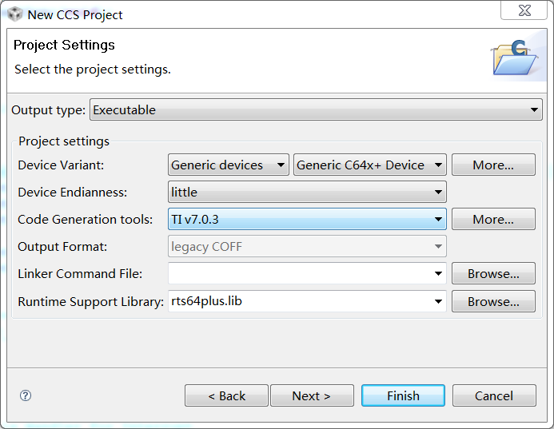

**第5步：** 选择dsk6455 Examples->Empty Example，点击Finish，工程建立过程到此完毕。


**第6步：** 将C6455的CSL库复制到新建工程目录下

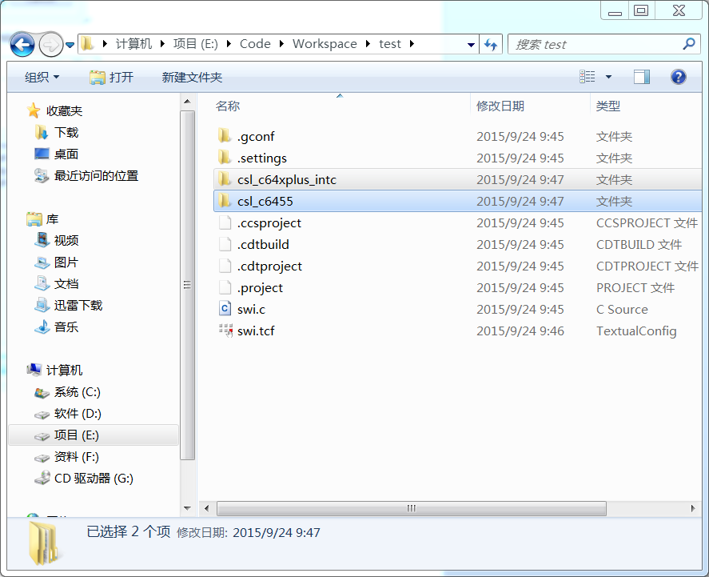

**第7步：** 右键点击工程->Properties->C++ Build->C6000 Compiler ->Include Options，添加CSL库头文件所在路径
```
"${PROJECT_ROOT}/csl_c64xplus_intc/inc"
"${PROJECT_ROOT}/csl_c6455/inc"
```
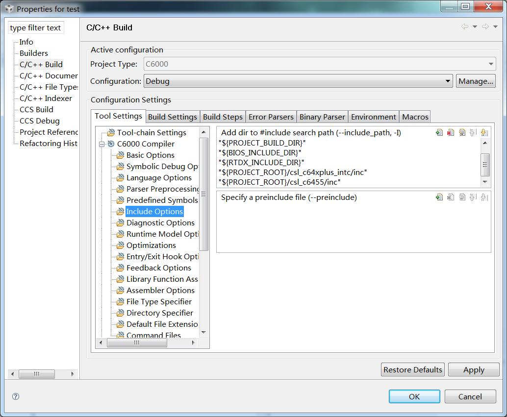

**第8步：** 点击Properties->C++ Build->C6000 Linker ->File Search Path, 添加CSL库文件所在路径
```
"${PROJECT_ROOT}/csl_c6455/lib/csl_c6455.lib"
"${PROJECT_ROOT}/csl_c64xplus_intc/lib/csl_c64xplus_intc.lib"
```
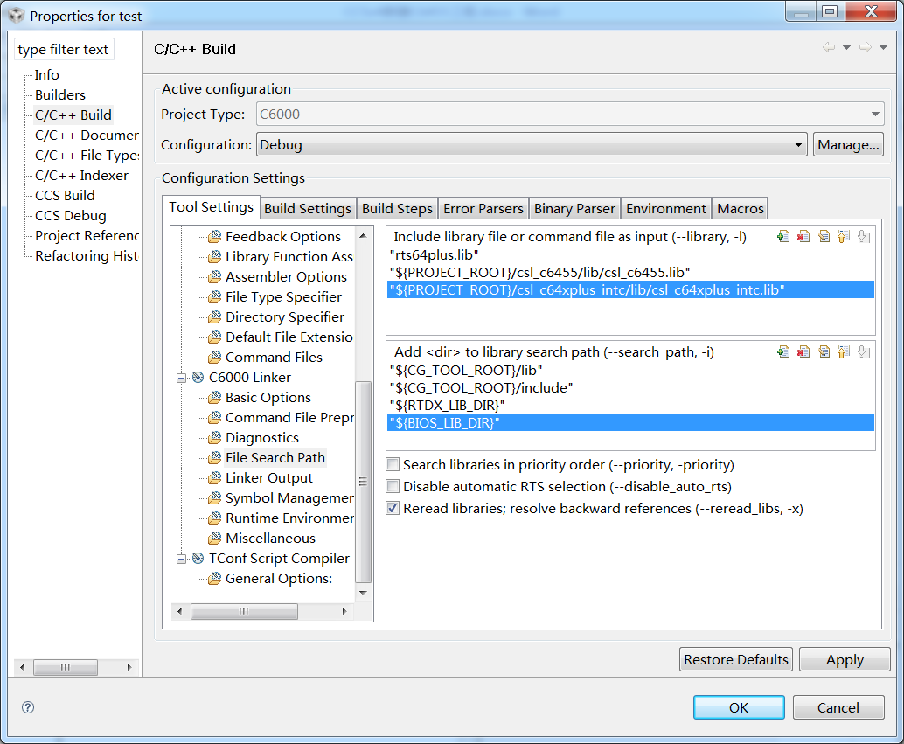

**第9步：** 将D:\\Texas Instruments\\ccsv4\\boards\\dsk6455_v2\\csl_c6455\\example\\gpio目录下的.c与.cmd文件复制到工程目录下，编译。可以看到编译通过

**第10步：** 如果是裸跑dsp需要写好main.c、cmd文件和intvecs.asm即可。而dspbios则更方便易用。在main.c文件基础上再用CCS创建tcf（DSP/BIOS configuration file）即可，而cmd文件和intvecs.asm（中断向量表的声明）在编译的时候有tcf文件自动生成。下面说明下如何从裸跑dsp核触发中断切换到使用dspbios实现这些功能。原工程是裸跑触发中断的，将改成使用dspbios的HWI线程方式来实现中断。

**第11步：** 把invecs.asm文件从工程remove掉。

**第12步：** 右键点击工程->New->DSP/BIOS v5.x Configuration File新建dspbios configuration file，点击Next，选择dsk6455，Finish

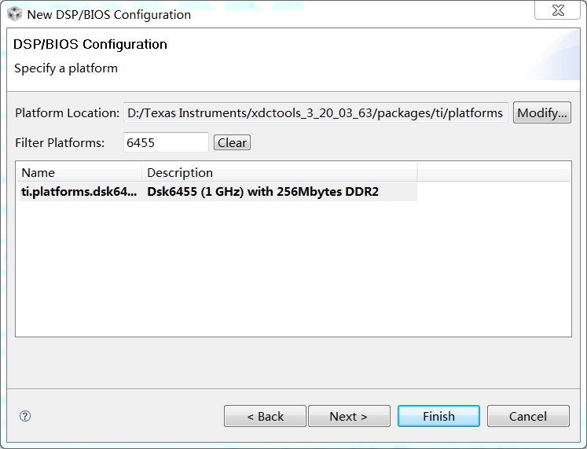

**第13步：** 开始配置tcf文件，Scheduling->HWI-Hardware Interrupt Service Routine Manager->HWI_INT4右键单击选择Propertie，interrupt selection number中选择15，function填上中断相应函数的名称，如果是C语言实现的要在前面加下划线，这里是_PCIinterrupt，其中interrupt selection number是指事件号，在TI的C6000系列中，有128个事件和15个中断源，需要通过配置把需要用到的事件号和中断源映射起来。

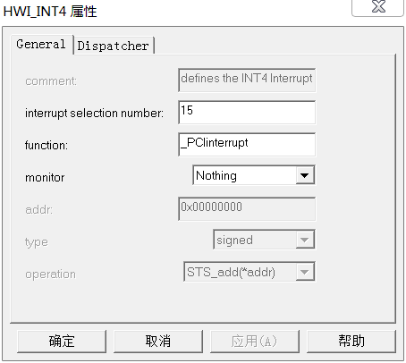

**第14步：** 修改cmd文件，由于MEMORY在tcf文件的System->MEM下已定义，所以要把注释掉，并将L2修改为MEM下对应的名称

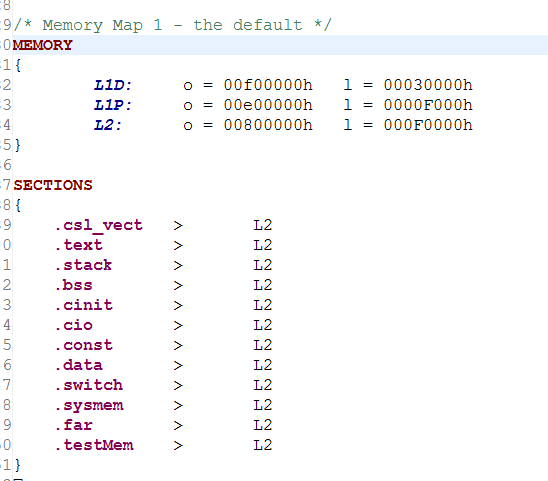 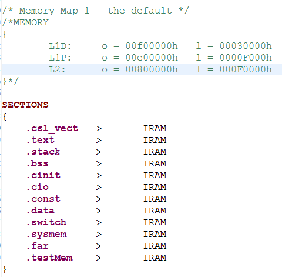

**第15步：** 在头文件中添加dspbios声明的头文件，其中testcfg.h文件是编译tcf文件生成的，test7cfg.h文件声明了各个线程如HWI、SWI、LOG等。并添加void PCIinterrupt()中断函数，这里必须去掉interrupt前缀。因为dspbios不需要关键字interrupt来注明这是中断响应函数，如果加上interrupt关键字有时会造成很大麻烦。

**第16步：** 整个dspbios工程建立完毕，编译直接把.out下载dsp核中就可触发中断。

**参考文献**

[使用CCS4进行DSP开发(Win7-64bit下DSP开发环境搭建)](http://blog.csdn.net/gjy938815/article/details/10023245)</br>
[DSPBIOS的HWI线程应用](http://blog.chinaunix.net/uid-29314073-id-4170817.html)
