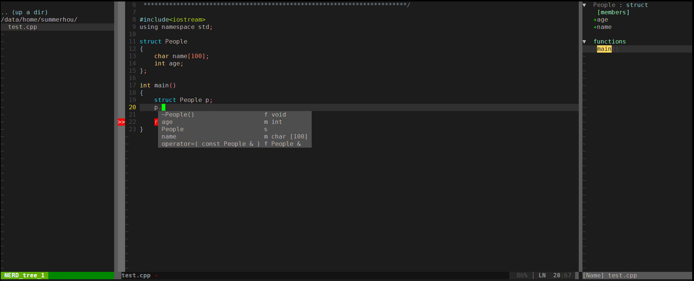

原文：[Vim代码补全插件：YouCompleteMe](http://blog.csdn.net/houzhuoming1/article/details/49990739)

**注意：** 若遇到映射`inoremap <c-h> <left>`导致`<BS>`键无法删除，可参考[《关于vim在插入模式中Backspace键无法删除的问题[转]》](关于vim在插入模式中Backspace键无法删除的问题[转].md)解决。

**1. 下载vim配置和插件安装附件**

```bash
git clone https://github.com/13570248114/vim_for_linux
```

文件说明：

* `libclang3.3`是`YouCompleteMe`的依赖库
* `vim`包含各种插件
* `.vimrc`是`vim`的配置文件
* `install.sh`是安装脚本
* `readme.txt`是安装说明

**2. 详细阅读安装脚本**

```bash
#!/bin/bash
echo "安装将花费一定时间，请耐心等待直到安装完成^_^"

echo "正在安装必备的软件^_^"
if which apt-get >/dev/null; then
    sudo apt-get update -y vi
    sudo apt-get install -y vim ctags cscope build-essential cmake python-dev
elif which yum >/dev/null; then
    sudo apt-get update -y vi
    sudo yum install -y gcc vim ctags cscope cmake gcc-c++ python-devel
    sudo yum groupinstall -y "Development Tools"
fi
sudo ln -s /usr/bin/ctags /usr/local/bin/ctags

echo "正在编译安装libclang3.3，大约二十分钟..."
cd ./libclang3.3
sudo chmod +x ./install.sh
./install.sh
echo "libclang3.3安装完成。^_^"
cd ..

echo "正在拷贝vim的插件和配置文件..."
rm -Rf ~/.vim*
mkdir ~/.vim
cp -R ./vim/* ~/.vim
cp ./.vimrc ~/
echo "vim插件和配置文件拷贝完成^_^"

echo "正在安装YouCompleteMe插件..."
cd ~/.vim/bundle/YouCompleteMe
sudo chmod +x ./install.sh
sudo chmod +x ./third_party/ycmd/build.sh
./install.sh --clang-completer --system-libclang
echo "YouCompleteMe安装完成"

echo "安装成功^_^"
```
1. 首先脚本会安装必要的软件，包括`vim ctags cscope build-essential cmake Python-dev`，如果已经安装可以注释这个部分。
2. 然后编译安装`libclang3.3`，该库是`YouCompleteMe`需要的，也可以通过其他途径安装该库，比如在`ubuntu`下可以直接使用`sudo apt-get install clang`进行安装。如已经安装可注释该部分。
3. 接着是`vim`插件和配置文件的拷贝，**注意，这个操作会将原本的`vim`配置和插件全部删掉**，请谨慎，如有特殊要求请自行复制。
4. 进行`YouCompleteMe`的编译安装。

**3. 效果图**



**4. 常用快捷键（仅限于附件对应的vim配置文件）**

1. 打开和关闭左边的目录窗口：`F2`
2. 窗口切换： `ctrl+w+方向键`（支持`h j k l`）
3. 打开右边的函数列表窗口：在普通模式下按`tb`
4. 跳转到函数定义：在普通模式下按`,jd`（别忽略逗号），需要在`.vimrc`上加上：
```vim
nnoremap <leader>jd :YcmCompleter GoToDefinitionElseDeclaration<CR>
```
5. 光标跳转：上一个位置`ctrl+o`，下一个位置`ctrl+i`
6. 代码注释：在普通模式下`,cc`（注释）`,cu`（取消注释）

**5. vim的配置文件**

```vim
" =============================================================================
"        << 判断操作系统是 Windows 还是 Linux 和判断是终端还是 Gvim >>
" =============================================================================

" -----------------------------------------------------------------------------
"  < 判断操作系统是否是 Windows 还是 Linux >
" -----------------------------------------------------------------------------
let g:iswindows = 0
let g:islinux = 0
if(has("win32") || has("win64") || has("win95") || has("win16"))
    let g:iswindows = 1
else
    let g:islinux = 1
endif

" -----------------------------------------------------------------------------
"  < 判断是终端还是 Gvim >
" -----------------------------------------------------------------------------
if has("gui_running")
    let g:isGUI = 1
else
    let g:isGUI = 0
endif


" =============================================================================
"                          << 以下为软件默认配置 >>
" =============================================================================

" -----------------------------------------------------------------------------
"  < Windows Gvim 默认配置> 做了一点修改
" -----------------------------------------------------------------------------
if (g:iswindows && g:isGUI)
    source $VIMRUNTIME/vimrc_example.vim
    source $VIMRUNTIME/mswin.vim
    behave mswin
    set diffexpr=MyDiff()

    function MyDiff()
        let opt = '-a --binary '
        if &diffopt =~ 'icase' | let opt = opt . '-i ' | endif
        if &diffopt =~ 'iwhite' | let opt = opt . '-b ' | endif
        let arg1 = v:fname_in
        if arg1 =~ ' ' | let arg1 = '"' . arg1 . '"' | endif
        let arg2 = v:fname_new
        if arg2 =~ ' ' | let arg2 = '"' . arg2 . '"' | endif
        let arg3 = v:fname_out
        if arg3 =~ ' ' | let arg3 = '"' . arg3 . '"' | endif
        let eq = ''
        if $VIMRUNTIME =~ ' '
            if &sh =~ '\<cmd'
                let cmd = '""' . $VIMRUNTIME . '\diff"'
                let eq = '"'
            else
                let cmd = substitute($VIMRUNTIME, ' ', '" ', '') . '\diff"'
            endif
        else
            let cmd = $VIMRUNTIME . '\diff'
        endif
        silent execute '!' . cmd . ' ' . opt . arg1 . ' ' . arg2 . ' > ' . arg3 . eq
    endfunction
endif

" -----------------------------------------------------------------------------
"  < Linux Gvim/Vim 默认配置> 做了一点修改
" -----------------------------------------------------------------------------
if g:islinux
    set hlsearch        "高亮搜索
    set incsearch       "在输入要搜索的文字时，实时匹配

    " Uncomment the following to have Vim jump to the last position when
    " reopening a file
    if has("autocmd")
        au BufReadPost * if line("'\"") > 1 && line("'\"") <= line("$") | exe "normal! g'\"" | endif
    endif

    if g:isGUI
        " Source a global configuration file if available
        if filereadable("/etc/vim/gvimrc.local")
            source /etc/vim/gvimrc.local
        endif
    else
        " This line should not be removed as it ensures that various options are
        " properly set to work with the Vim-related packages available in Debian.
        runtime! debian.vim

        " Vim5 and later versions support syntax highlighting. Uncommenting the next
        " line enables syntax highlighting by default.
        if has("syntax")
            syntax on
        endif

        set mouse=a                    " 在任何模式下启用鼠标
        set t_Co=256                   " 在终端启用256色
        set backspace=2                " 设置退格键可用

        " Source a global configuration file if available
        if filereadable("/etc/vim/vimrc.local")
            source /etc/vim/vimrc.local
        endif
    endif
endif


" =============================================================================
"                          << 以下为用户自定义配置 >>
" =============================================================================

" -----------------------------------------------------------------------------
"  < Vundle 插件管理工具配置 >
" -----------------------------------------------------------------------------
" 用于更方便的管理vim插件，具体用法参考 :h vundle 帮助
" Vundle工具安装方法为在终端输入如下命令
" git clone https://github.com/gmarik/vundle.git ~/.vim/bundle/vundle
" 如果想在 windows 安装就必需先安装 "git for window"，可查阅网上资料

set nocompatible                                      "禁用 Vi 兼容模式
filetype off                                          "禁用文件类型侦测

if g:islinux
    set rtp+=~/.vim/bundle/vundle/
    call vundle#rc()
else
    set rtp+=$VIM/vimfiles/bundle/vundle/
    call vundle#rc('$VIM/vimfiles/bundle/')
endif

" 使用Vundle来管理插件，这个必须要有。
Bundle 'gmarik/vundle'

" 以下为要安装或更新的插件，不同仓库都有（具体书写规范请参考帮助）
Bundle 'a.vim'
Bundle 'Align'
Bundle 'jiangmiao/auto-pairs'
Bundle 'bufexplorer.zip'
Bundle 'ccvext.vim'
Bundle 'cSyntaxAfter'
Bundle 'ctrlpvim/ctrlp.vim'
Bundle 'mattn/emmet-vim'
Bundle 'Yggdroot/indentLine'
Bundle 'vim-javacompleteex'
Bundle 'Mark--Karkat'
Bundle 'scrooloose/nerdcommenter'
Bundle 'scrooloose/nerdtree'
Bundle 'Lokaltog/vim-powerline'
Bundle 'repeat.vim'
Bundle 'msanders/snipmate.vim'
Bundle 'wesleyche/SrcExpl'
Bundle 'std_c.zip'
Bundle 'tpope/vim-surround'
Bundle 'scrooloose/syntastic'
Bundle 'majutsushi/tagbar'
Bundle 'taglist.vim'
Bundle 'TxtBrowser'
Bundle 'ZoomWin'
Bundle 'Valloric/YouCompleteMe'

" -----------------------------------------------------------------------------
"  < 编码配置 >
" -----------------------------------------------------------------------------
" 注：使用utf-8格式后，软件与程序源码、文件路径不能有中文，否则报错
set encoding=utf-8                                    "设置gvim内部编码，默认不更改
set fileencoding=utf-8                                "设置当前文件编码，可以更改，如：gbk（同cp936）
set fileencodings=ucs-bom,utf-8,gbk,cp936,latin-1     "设置支持打开的文件的编码

" 文件格式，默认 ffs=dos,unix
set fileformat=unix                                   "设置新（当前）文件的<EOL>格式，可以更改，如：dos（windows系统常用）
set fileformats=unix,dos,mac                          "给出文件的<EOL>格式类型

if (g:iswindows && g:isGUI)
    "解决菜单乱码
    source $VIMRUNTIME/delmenu.vim
    source $VIMRUNTIME/menu.vim

    "解决consle输出乱码
    language messages zh_CN.utf-8
endif

" -----------------------------------------------------------------------------
"  < 编写文件时的配置 >
" -----------------------------------------------------------------------------
filetype on                                           "启用文件类型侦测
filetype plugin on                                    "针对不同的文件类型加载对应的插件
filetype plugin indent on                             "启用缩进
set smartindent                                       "启用智能对齐方式
set expandtab                                         "将Tab键转换为空格
set tabstop=4                                         "设置Tab键的宽度，可以更改，如：宽度为2
set shiftwidth=4                                      "换行时自动缩进宽度，可更改（宽度同tabstop）
set smarttab                                          "指定按一次backspace就删除shiftwidth宽度
set foldenable                                        "启用折叠
set foldmethod=indent                                 "indent 折叠方式
set foldlevel=9999                                    " 折叠的层次，打开文件时默认不折叠

" 常规模式下用空格键来开关光标行所在折叠（注：zR 展开所有折叠，zM 关闭所有折叠）
nnoremap <space> @=((foldclosed(line('.')) < 0) ? 'zc' : 'zo')<CR>

" 当文件在外部被修改，自动更新该文件
set autoread

" 常规模式下输入 cS 清除行尾空格
nmap cS :%s/\s\+$//g<CR>:noh<CR>

" 常规模式下输入 cM 清除行尾 ^M 符号
nmap cM :%s/\r$//g<CR>:noh<CR>

set ignorecase                                        "搜索模式里忽略大小写
set smartcase                                         "如果搜索模式包含大写字符，不使用 'ignorecase' 选项，只有在输入搜索模式并且打开 'ignorecase' 选项时才会使用
" set noincsearch                                       "在输入要搜索的文字时，取消实时匹配

" Ctrl + K 插入模式下光标向上移动
imap <c-k> <Up>

" Ctrl + J 插入模式下光标向下移动
imap <c-j> <Down>

" Ctrl + H 插入模式下光标向左移动
imap <c-h> <Left>

" Ctrl + L 插入模式下光标向右移动
imap <c-l> <Right>

" Ctrl + f 光标跳转到行头
imap <c-f> <ESC>0i

" Ctrl + e 光标跳转到行尾
imap <c-e> <ESC>$i

" 全选
nmap <c-a> ggVG$
imap <c-a> <ESC>ggVG$


" 启用每行超过80列的字符提示（字体变蓝并加下划线），不启用就注释掉
au BufWinEnter * let w:m2=matchadd('Underlined', '\%>' . 80 . 'v.\+', -1)

" -----------------------------------------------------------------------------
"  < 界面配置 >
" -----------------------------------------------------------------------------
set number                                            "显示行号
set laststatus=2                                      "启用状态栏信息
set cmdheight=2                                       "设置命令行的高度为2，默认为1
set cursorline                                        "突出显示当前行
" set guifont=YaHei_Consolas_Hybrid:h10                 "设置字体:字号（字体名称空格用下划线代替）
set nowrap                                            "设置不自动换行
set shortmess=atI                                     "去掉欢迎界面

" 设置 gVim 窗口初始位置及大小
if g:isGUI
    " au GUIEnter * simalt ~x                           "窗口启动时自动最大化
    winpos 100 10                                     "指定窗口出现的位置，坐标原点在屏幕左上角
    set lines=38 columns=120                          "指定窗口大小，lines为高度，columns为宽度
endif

" 设置代码配色方案
if g:isGUI
    colorscheme Tomorrow-Night-Eighties               "Gvim配色方案
else
    colorscheme Tomorrow-Night-Eighties               "终端配色方案
endif

" 显示/隐藏菜单栏、工具栏、滚动条，可用 Ctrl + F11 切换
if g:isGUI
    set guioptions-=m
    set guioptions-=T
    set guioptions-=r
    set guioptions-=L
    nmap <silent> <c-F11> :if &guioptions =~# 'm' <Bar>
        \set guioptions-=m <Bar>
        \set guioptions-=T <Bar>
        \set guioptions-=r <Bar>
        \set guioptions-=L <Bar>
    \else <Bar>
        \set guioptions+=m <Bar>
        \set guioptions+=T <Bar>
        \set guioptions+=r <Bar>
        \set guioptions+=L <Bar>
    \endif<CR>
endif

" -----------------------------------------------------------------------------
"  < 编译、连接、运行配置 (目前只配置了C、C++、Java语言)>
" -----------------------------------------------------------------------------
" F5 一键保存、编译、连接存并运行
nmap <F5> :call Run()<CR>
imap <F5> <ESC>:call Run()<CR>

" Ctrl + F5 一键保存并编译
nmap <c-F5> :call Compile()<CR>
imap <c-F5> <ESC>:call Compile()<CR>

"C,C++的调试
map <F6> :call Rungdb()<CR>
imap <F6> <ESC>:call Rungdb()<CR>

" Ctrl + F6 一键保存并连接
nmap <c-F6> :call Link()<CR>
imap <c-F6> <ESC>:call Link()<CR>

let s:LastShellReturn_C = 0
let s:LastShellReturn_L = 0
let s:ShowWarning = 1
let s:Obj_Extension = '.o'
let s:Exe_Extension = '.exe'
let s:Class_Extension = '.class'
let s:Sou_Error = 0

let s:windows_CFlags = 'gcc\ -fexec-charset=gbk\ -Wall\ -g\ -O0\ -c\ %\ -o\ %<.o'
let s:linux_CFlags = 'gcc\ -Wall\ -g\ -O0\ -c\ %\ -o\ %<.o'

let s:windows_CPPFlags = 'g++\ -fexec-charset=gbk\ -Wall\ -g\ -O0\ -c\ %\ -o\ %<.o'
let s:linux_CPPFlags = 'g++\ -Wall\ -g\ -O0\ -c\ %\ -o\ %<.o'

let s:JavaFlags = 'javac\ %'

func! Compile()
    exe ":w"
    exe ":ccl"
    exe ":update"
    let s:Sou_Error = 0
    let s:LastShellReturn_C = 0
    let Sou = expand("%:p")
    let v:statusmsg = ''
    if expand("%:e") == "c" || expand("%:e") == "cpp" || expand("%:e") == "cxx"
        let Obj = expand("%:p:r").s:Obj_Extension
        let Obj_Name = expand("%:p:t:r").s:Obj_Extension
        if !filereadable(Obj) || (filereadable(Obj) && (getftime(Obj) < getftime(Sou)))
            redraw!
            if expand("%:e") == "c"
                if g:iswindows
                    exe ":setlocal makeprg=".s:windows_CFlags
                else
                    exe ":setlocal makeprg=".s:linux_CFlags
                endif
                echohl WarningMsg | echo " compiling..."
                silent make
            elseif expand("%:e") == "cpp" || expand("%:e") == "cxx"
                if g:iswindows
                    exe ":setlocal makeprg=".s:windows_CPPFlags
                else
                    exe ":setlocal makeprg=".s:linux_CPPFlags
                endif
                echohl WarningMsg | echo " compiling..."
                silent make
            endif
            redraw!
            if v:shell_error != 0
                let s:LastShellReturn_C = v:shell_error
            endif
            if g:iswindows
                if s:LastShellReturn_C != 0
                    exe ":bo cope"
                    echohl WarningMsg | echo " compilation failed"
                else
                    if s:ShowWarning
                        exe ":bo cw"
                    endif
                    echohl WarningMsg | echo " compilation successful"
                endif
            else
                if empty(v:statusmsg)
                    echohl WarningMsg | echo " compilation successful"
                else
                    exe ":bo cope"
                endif
            endif
        else
            echohl WarningMsg | echo ""Obj_Name"is up to date"
        endif
    elseif expand("%:e") == "java"
        let class = expand("%:p:r").s:Class_Extension
        let class_Name = expand("%:p:t:r").s:Class_Extension
        if !filereadable(class) || (filereadable(class) && (getftime(class) < getftime(Sou)))
            redraw!
            exe ":setlocal makeprg=".s:JavaFlags
            echohl WarningMsg | echo " compiling..."
            silent make
            redraw!
            if v:shell_error != 0
                let s:LastShellReturn_C = v:shell_error
            endif
            if g:iswindows
                if s:LastShellReturn_C != 0
                    exe ":bo cope"
                    echohl WarningMsg | echo " compilation failed"
                else
                    if s:ShowWarning
                        exe ":bo cw"
                    endif
                    echohl WarningMsg | echo " compilation successful"
                endif
            else
                if empty(v:statusmsg)
                    echohl WarningMsg | echo " compilation successful"
                else
                    exe ":bo cope"
                endif
            endif
        else
            echohl WarningMsg | echo ""class_Name"is up to date"
        endif
    else
        let s:Sou_Error = 1
        echohl WarningMsg | echo " please choose the correct source file"
    endif
    exe ":setlocal makeprg=make"
endfunc

func! Link()
    call Compile()
    if s:Sou_Error || s:LastShellReturn_C != 0
        return
    endif
    if expand("%:e") == "c" || expand("%:e") == "cpp" || expand("%:e") == "cxx"
        let s:LastShellReturn_L = 0
        let Sou = expand("%:p")
        let Obj = expand("%:p:r").s:Obj_Extension
        if g:iswindows
            let Exe = expand("%:p:r").s:Exe_Extension
            let Exe_Name = expand("%:p:t:r").s:Exe_Extension
        else
            let Exe = expand("%:p:r")
            let Exe_Name = expand("%:p:t:r")
        endif
        let v:statusmsg = ''
        if filereadable(Obj) && (getftime(Obj) >= getftime(Sou))
            redraw!
            if !executable(Exe) || (executable(Exe) && getftime(Exe) < getftime(Obj))
                if expand("%:e") == "c"
                    setlocal makeprg=gcc\ -o\ %<\ %<.o
                    echohl WarningMsg | echo " linking..."
                    silent make
                elseif expand("%:e") == "cpp" || expand("%:e") == "cxx"
                    setlocal makeprg=g++\ -o\ %<\ %<.o
                    echohl WarningMsg | echo " linking..."
                    silent make
                endif
                redraw!
                if v:shell_error != 0
                    let s:LastShellReturn_L = v:shell_error
                endif
                if g:iswindows
                    if s:LastShellReturn_L != 0
                        exe ":bo cope"
                        echohl WarningMsg | echo " linking failed"
                    else
                        if s:ShowWarning
                            exe ":bo cw"
                        endif
                        echohl WarningMsg | echo " linking successful"
                    endif
                else
                    if empty(v:statusmsg)
                        echohl WarningMsg | echo " linking successful"
                    else
                        exe ":bo cope"
                    endif
                endif
            else
                echohl WarningMsg | echo ""Exe_Name"is up to date"
            endif
        endif
        setlocal makeprg=make
    elseif expand("%:e") == "java"
        return
    endif
endfunc

func! Run()
    if expand("%:e") == "py"
        exe ":w"
        exe ":!python %"
        return
    endif

    let s:ShowWarning = 0
    call Link()
    let s:ShowWarning = 1
    if s:Sou_Error || s:LastShellReturn_C != 0 || s:LastShellReturn_L != 0
        return
    endif
    let Sou = expand("%:p")
    if expand("%:e") == "c" || expand("%:e") == "cpp" || expand("%:e") == "cxx"
        let Obj = expand("%:p:r").s:Obj_Extension
        if g:iswindows
            let Exe = expand("%:p:r").s:Exe_Extension
        else
            let Exe = expand("%:p:r")
        endif
        if executable(Exe) && getftime(Exe) >= getftime(Obj) && getftime(Obj) >= getftime(Sou)
            redraw!
            echohl WarningMsg | echo " running..."
            if g:iswindows
                exe ":!%<.exe"
            else
                if g:isGUI
                    exe ":!gnome-terminal -x bash -c './%<; echo; echo 请按 Enter 键继续; read'"
                else
                    exe ":!clear; ./%<"
                endif
            endif
            redraw!
            echohl WarningMsg | echo " running finish"
        endif
    elseif expand("%:e") == "java"
        let class = expand("%:p:r").s:Class_Extension
        if getftime(class) >= getftime(Sou)
            redraw!
            echohl WarningMsg | echo " running..."
            if g:iswindows
                exe ":!java %<"
            else
                if g:isGUI
                    exe ":!gnome-terminal -x bash -c 'java %<; echo; echo 请按 Enter 键继续; read'"
                else
                    exe ":!clear; java %<"
                endif
            endif
            redraw!
            echohl WarningMsg | echo " running finish"
        endif
    endif
endfunc

func! Rungdb()
    if g:islinux
        if expand("%:e") == "c" || expand("%:e") == "cpp" || expand("%:e") == "cxx"
            call Link()
            exec "!gdb ./%<"
        else
            echohl WarningMsg | echo " only .c,.cpp or .cxx file can use gdb"
        endif
    else
        echohl WarningMsg | echo " gdb must be called in Linux"
    endif
endfunc

" -----------------------------------------------------------------------------
"  < 新文件标题 >
" -----------------------------------------------------------------------------
"新建.c,.h,.sh,.java文件，自动插入文件头
autocmd BufNewFile *.cpp,*.[ch],*.sh,*.rb,*.java,*.py exec ":call SetTitle()"
""定义函数SetTitle，自动插入文件头
func SetTitle()
    "如果文件类型为.sh文件
    if &filetype == 'sh'
        call setline(1,"\#!/bin/bash")
        call append(line("."), "")
    elseif &filetype == 'python'
        call setline(1,"#!/usr/bin/env python")
        call append(line("."),"# coding=utf-8")
        call append(line(".")+1, "")

    elseif &filetype == 'ruby'
        call setline(1,"#!/usr/bin/env ruby")
        call append(line("."),"# encoding: utf-8")
        call append(line(".")+1, "")

"    elseif &filetype == 'mkd'
"        call setline(1,"<head><meta charset=\"UTF-8\"></head>")
    else
        call setline(1, "/*************************************************************************")
        call append(line("."), "    > File Name: ".expand("%"))
        call append(line(".")+1, "  > Author: Hou")
        call append(line(".")+2, "  > Mail: 745189913@qq.com")
        call append(line(".")+3, "  > Created Time: ".strftime("%c"))
        call append(line(".")+4, " ************************************************************************/")
        call append(line(".")+5, "")
    endif
    if expand("%:e") == 'cpp'
        call append(line(".")+6, "#include<iostream>")
        call append(line(".")+7, "using namespace std;")
        call append(line(".")+8, "")
    endif
    if &filetype == 'c'
        call append(line(".")+6, "#include<stdio.h>")
        call append(line(".")+7, "")
    endif
    if expand("%:e") == 'h'
        call append(line(".")+6, "#ifndef _".toupper(expand("%:r"))."_H")
        call append(line(".")+7, "#define _".toupper(expand("%:r"))."_H")
        call append(line(".")+8, "#endif")
    endif
    if &filetype == 'java'
        call append(line(".")+6,"public class ".expand("%:r"))
        call append(line(".")+7,"")
    endif
    "新建文件后，自动定位到文件末尾
endfunc
autocmd BufNewFile * normal G


" -----------------------------------------------------------------------------
"  < 在浏览器中预览 Html 或 PHP 文件 >
" -----------------------------------------------------------------------------
" 修改前请先通读此模块，明白了再改以避免错误

" F9 加浏览器名称缩写调用浏览器预览，启用前先确定有安装相应浏览器，并在下面的配置好其安装目录
if g:iswindows
    "以下为只支持Windows系统的浏览器

    " 调用系统IE浏览器预览，如果已卸载可将其注释
    nmap <F9>ie :call ViewInBrowser("ie")<cr>
    imap <F9>ie <ESC>:call ViewInBrowser("ie")<cr>

    " 调用IETester(IE测试工具)预览，如果有安装可取消注释
    " nmap <F9>ie6 :call ViewInBrowser("ie6")<cr>
    " imap <F9>ie6 <ESC>:call ViewInBrowser("ie6")<cr>
    " nmap <F9>ie7 :call ViewInBrowser("ie7")<cr>
    " imap <F9>ie7 <ESC>:call ViewInBrowser("ie7")<cr>
    " nmap <F9>ie8 :call ViewInBrowser("ie8")<cr>
    " imap <F9>ie8 <ESC>:call ViewInBrowser("ie8")<cr>
    " nmap <F9>ie9 :call ViewInBrowser("ie9")<cr>
    " imap <F9>ie9 <ESC>:call ViewInBrowser("ie9")<cr>
    " nmap <F9>ie10 :call ViewInBrowser("ie10")<cr>
    " imap <F9>ie10 <ESC>:call ViewInBrowser("ie10")<cr>
    " nmap <F9>iea :call ViewInBrowser("iea")<cr>
    " imap <F9>iea <ESC>:call ViewInBrowser("iea")<cr>
elseif g:islinux
    "以下为只支持Linux系统的浏览器
    "暂未配置，待有时间再弄了
endif

"以下为支持Windows与Linux系统的浏览器

" 调用Firefox浏览器预览，如果有安装可取消注释
" nmap <F9>ff :call ViewInBrowser("ff")<cr>
" imap <F9>ff <ESC>:call ViewInBrowser("ff")<cr>

" 调用Maxthon(遨游)浏览器预览，如果有安装可取消注释
" nmap <F9>ay :call ViewInBrowser("ay")<cr>
" imap <F9>ay <ESC>:call ViewInBrowser("ay")<cr>

" 调用Opera浏览器预览，如果有安装可取消注释
" nmap <F9>op :call ViewInBrowser("op")<cr>
" imap <F9>op <ESC>:call ViewInBrowser("op")<cr>

" 调用Chrome浏览器预览，如果有安装可取消注释
" nmap <F9>cr :call ViewInBrowser("cr")<cr>
" imap <F9>cr <ESC>:call ViewInBrowser("cr")<cr>

" 浏览器调用函数
function! ViewInBrowser(name)
    if expand("%:e") == "php" || expand("%:e") == "html"
        exe ":update"
        if g:iswindows
            "获取要预览的文件路径，并将路径中的'\'替换为'/'，同时将路径文字的编码转换为gbk（同cp936）
            let file = iconv(substitute(expand("%:p"), '\', '/', "g"), "utf-8", "gbk")

            "浏览器路径设置，路径中使用'/'斜杠，更改路径请更改双引号里的内容
            "下面只启用了系统IE浏览器，如需启用其它的可将其取消注释（得先安装，并配置好安装路径），也可按需增减
            let SystemIE = "C:/progra~1/intern~1/iexplore.exe"  "系统自带IE目录
            " let IETester = "F:/IETester/IETester.exe"           "IETester程序目录（可按实际更改）
            " let Chrome = "F:/Chrome/Chrome.exe"                 "Chrome程序目录（可按实际更改）
            " let Firefox = "F:/Firefox/Firefox.exe"              "Firefox程序目录（可按实际更改）
            " let Opera = "F:/Opera/opera.exe"                    "Opera程序目录（可按实际更改）
            " let Maxthon = "C:/Progra~2/Maxthon/Bin/Maxthon.exe" "Maxthon程序目录（可按实际更改）

            "本地虚拟服务器设置，我测试的是phpStudy2014，可根据自己的修改，更改路径请更改双引号里的内容
            let htdocs ="F:/phpStudy2014/WWW/"                  "虚拟服务器地址或目录（可按实际更改）
            let url = "localhost"                               "虚拟服务器网址（可按实际更改）
        elseif g:islinux
            "暂时还没有配置，有时间再弄了。
        endif

        "浏览器调用缩写，可根据实际增减，注意，上面浏览器路径中没有定义过的变量（等号右边为变量）不能出现在下面哟（可将其注释或删除）
        let l:browsers = {}                             "定义缩写字典变量，此行不能删除或注释
        " let l:browsers["cr"] = Chrome                   "Chrome浏览器缩写
        " let l:browsers["ff"] = Firefox                  "Firefox浏览器缩写
        " let l:browsers["op"] = Opera                    "Opera浏览器缩写
        " let l:browsers["ay"] = Maxthon                  "遨游浏览器缩写
        let l:browsers["ie"] = SystemIE                 "系统IE浏览器缩写
        " let l:browsers["ie6"] = IETester."-ie6"         "调用IETESTER工具以IE6预览缩写（变量加参数）
        " let l:browsers["ie7"] = IETester."-ie7"         "调用IETESTER工具以IE7预览缩写（变量加参数）
        " let l:browsers["ie8"] = IETester."-ie8"         "调用IETESTER工具以IE8预览缩写（变量加参数）
        " let l:browsers["ie9"] = IETester."-ie9"         "调用IETESTER工具以IE9预览缩写（变量加参数）
        " let l:browsers["ie10"] = IETester."-ie10"       "调用IETESTER工具以IE10预览缩写（变量加参数）
        " let l:browsers["iea"] = IETester."-al"          "调用IETESTER工具以支持的所有IE版本预览缩写（变量加参数）

        if stridx(file, htdocs) == -1   "文件不在本地虚拟服务器目录，则直接预览（但不能解析PHP文件）
           exec ":silent !start ". l:browsers[a:name] ." file://" . file
        else    "文件在本地虚拟服务器目录，则调用本地虚拟服务器解析预览（先启动本地虚拟服务器）
            let file = substitute(file, htdocs, "http://".url."/", "g")    "转换文件路径为虚拟服务器网址路径
            exec ":silent !start ". l:browsers[a:name] file
        endif
    else
        echohl WarningMsg | echo " please choose the correct source file"
    endif
endfunction

" -----------------------------------------------------------------------------
"  < 其它配置 >
" -----------------------------------------------------------------------------
set writebackup                             "保存文件前建立备份，保存成功后删除该备份
set nobackup                                "设置无备份文件
" set noswapfile                              "设置无临时文件
" set vb t_vb=                                "关闭提示音


" =============================================================================
"                          << 以下为常用插件配置 >>
" =============================================================================

" -----------------------------------------------------------------------------
"  < a.vim 插件配置 >
" -----------------------------------------------------------------------------
" 用于切换C/C++头文件
" :A     ---切换头文件并独占整个窗口
" :AV    ---切换头文件并垂直分割窗口
" :AS    ---切换头文件并水平分割窗口

" -----------------------------------------------------------------------------
"  < Align 插件配置 >
" -----------------------------------------------------------------------------
" 一个对齐的插件，用来——排版与对齐代码，功能强大，不过用到的机会不多

" -----------------------------------------------------------------------------
"  < auto-pairs 插件配置 >
" -----------------------------------------------------------------------------
" 用于括号与引号自动补全，不过会与函数原型提示插件echofunc冲突
" 所以我就没有加入echofunc插件

" -----------------------------------------------------------------------------
"  < BufExplorer 插件配置 >
" -----------------------------------------------------------------------------
" 快速轻松的在缓存中切换（相当于另一种多个文件间的切换方式）
" <Leader>be 在当前窗口显示缓存列表并打开选定文件
" <Leader>bs 水平分割窗口显示缓存列表，并在缓存列表窗口中打开选定文件
" <Leader>bv 垂直分割窗口显示缓存列表，并在缓存列表窗口中打开选定文件

" -----------------------------------------------------------------------------
"  < ccvext.vim 插件配置 >
" -----------------------------------------------------------------------------
" 用于对指定文件自动生成tags与cscope文件并连接
" 如果是Windows系统, 则生成的文件在源文件所在盘符根目录的.symbs目录下(如: X:\.symbs\)
" 如果是Linux系统, 则生成的文件在~/.symbs/目录下
" 具体用法可参考www.vim.org中此插件的说明
" <Leader>sy 自动生成tags与cscope文件并连接
" <Leader>sc 连接已存在的tags与cscope文件

" -----------------------------------------------------------------------------
"  < cSyntaxAfter 插件配置 >
" -----------------------------------------------------------------------------
" 高亮括号与运算符等
au! BufRead,BufNewFile,BufEnter *.{c,cpp,h,java,javascript} call CSyntaxAfter()

" -----------------------------------------------------------------------------
"  < ctrlp.vim 插件配置 >
" -----------------------------------------------------------------------------
" 一个全路径模糊文件，缓冲区，最近最多使用，... 检索插件；详细帮助见 :h ctrlp
" 常规模式下输入：Ctrl + p 调用插件

" -----------------------------------------------------------------------------
"  < emmet-vim（前身为Zen coding） 插件配置 >
" -----------------------------------------------------------------------------
" HTML/CSS代码快速编写神器，详细帮助见 :h emmet.txt

" -----------------------------------------------------------------------------
"  < indentLine 插件配置 >
" -----------------------------------------------------------------------------
" 用于显示对齐线，与 indent_guides 在显示方式上不同，根据自己喜好选择了
" 在终端上会有屏幕刷新的问题，这个问题能解决有更好了
" 开启/关闭对齐线
nmap <leader>il :IndentLinesToggle<CR>

" 设置Gvim的对齐线样式
if g:isGUI
    let g:indentLine_char = "┊"
    let g:indentLine_first_char = "┊"
endif

" 设置终端对齐线颜色，如果不喜欢可以将其注释掉采用默认颜色
let g:indentLine_color_term = 239

" 设置 GUI 对齐线颜色，如果不喜欢可以将其注释掉采用默认颜色
" let g:indentLine_color_gui = '#A4E57E'

" -----------------------------------------------------------------------------
"  < vim-javacompleteex（也就是 javacomplete 增强版）插件配置 >
" -----------------------------------------------------------------------------
" java 补全插件

" -----------------------------------------------------------------------------
"  < Mark--Karkat（也就是 Mark） 插件配置 >
" -----------------------------------------------------------------------------
" 给不同的单词高亮，表明不同的变量时很有用，详细帮助见 :h mark.txt

" " -----------------------------------------------------------------------------
" "  < MiniBufExplorer 插件配置 >
" " -----------------------------------------------------------------------------
" " 快速浏览和操作Buffer
" " 主要用于同时打开多个文件并相与切换

" " let g:miniBufExplMapWindowNavArrows = 1     "用Ctrl加方向键切换到上下左右的窗口中去
" let g:miniBufExplMapWindowNavVim = 1        "用<C-k,j,h,l>切换到上下左右的窗口中去
" let g:miniBufExplMapCTabSwitchBufs = 1      "功能增强（不过好像只有在Windows中才有用）
" "                                            <C-Tab> 向前循环切换到每个buffer上,并在但前窗口打开
" "                                            <C-S-Tab> 向后循环切换到每个buffer上,并在当前窗口打开

" 在不使用 MiniBufExplorer 插件时也可用<C-k,j,h,l>切换到上下左右的窗口中去
noremap <c-k> <c-w>k
noremap <c-j> <c-w>j
noremap <c-h> <c-w>h
noremap <c-l> <c-w>l


" -----------------------------------------------------------------------------
"  < nerdcommenter 插件配置 >
" -----------------------------------------------------------------------------
" 我主要用于C/C++代码注释(其它的也行)
" 以下为插件默认快捷键，其中的说明是以C/C++为例的，其它语言类似
" <Leader>ci 以每行一个 /* */ 注释选中行(选中区域所在行)，再输入则取消注释
" <Leader>cm 以一个 /* */ 注释选中行(选中区域所在行)，再输入则称重复注释
" <Leader>cc 以每行一个 /* */ 注释选中行或区域，再输入则称重复注释
" <Leader>cu 取消选中区域(行)的注释，选中区域(行)内至少有一个 /* */
" <Leader>ca 在/*...*/与//这两种注释方式中切换（其它语言可能不一样了）
" <Leader>cA 行尾注释
let NERDSpaceDelims = 1                     "在左注释符之后，右注释符之前留有空格

" -----------------------------------------------------------------------------
"  < nerdtree 插件配置 >
" -----------------------------------------------------------------------------
" 有目录村结构的文件浏览插件

" 常规模式下输入 F2 调用插件
nmap <F2> :NERDTreeToggle<CR>
"当打开vim且没有文件时自动打开NERDTree
"autocmd vimenter * if !argc() | NERDTree | endif

" -----------------------------------------------------------------------------
"  < powerline 插件配置 >
" -----------------------------------------------------------------------------
" 状态栏插件，更好的状态栏效果

" -----------------------------------------------------------------------------
"  < repeat 插件配置 >
" -----------------------------------------------------------------------------
" 主要用"."命令来重复上次插件使用的命令

" -----------------------------------------------------------------------------
"  < snipMate 插件配置 >
" -----------------------------------------------------------------------------
" 用于各种代码补全，这种补全是一种对代码中的词与代码块的缩写补全，详细用法可以参
" 考使用说明或网络教程等。不过有时候也会与 supertab 插件在补全时产生冲突，如果大
" 侠有什么其它解决方法希望不要保留呀

" -----------------------------------------------------------------------------
"  < SrcExpl 插件配置 >
" -----------------------------------------------------------------------------
" 增强源代码浏览，其功能就像Windows中的"Source Insight"
nmap <F3> :SrcExplToggle<CR>                "打开/闭浏览窗口

" -----------------------------------------------------------------------------
"  < std_c 插件配置 >
" -----------------------------------------------------------------------------
" 用于增强C语法高亮

" 启用 // 注视风格
let c_cpp_comments = 0

" -----------------------------------------------------------------------------
"  < surround 插件配置 >
" -----------------------------------------------------------------------------
" 快速给单词/句子两边增加符号（包括html标签），缺点是不能用"."来重复命令
" 不过 repeat 插件可以解决这个问题，详细帮助见 :h surround.txt

" -----------------------------------------------------------------------------
"  < Syntastic 插件配置 >
" -----------------------------------------------------------------------------
" 用于保存文件时查检语法

" -----------------------------------------------------------------------------
"  < Tagbar 插件配置 >
" -----------------------------------------------------------------------------
" 相对 TagList 能更好的支持面向对象

" 常规模式下输入 tb 调用插件，如果有打开 TagList 窗口则先将其关闭
nmap tb :TlistClose<CR>:TagbarToggle<CR>

let g:tagbar_width=30                       "设置窗口宽度
" let g:tagbar_left=1                         "在左侧窗口中显示

" -----------------------------------------------------------------------------
"  < TagList 插件配置 >
" -----------------------------------------------------------------------------
" 高效地浏览源码, 其功能就像vc中的workpace
" 那里面列出了当前文件中的所有宏,全局变量, 函数名等

" 常规模式下输入 tl 调用插件，如果有打开 Tagbar 窗口则先将其关闭
nmap tl :TagbarClose<CR>:Tlist<CR>

let Tlist_Show_One_File=1                   "只显示当前文件的tags
" let Tlist_Enable_Fold_Column=0              "使taglist插件不显示左边的折叠行
let Tlist_Exit_OnlyWindow=1                 "如果Taglist窗口是最后一个窗口则退出Vim
let Tlist_File_Fold_Auto_Close=1            "自动折叠
let Tlist_WinWidth=30                       "设置窗口宽度
let Tlist_Use_Right_Window=1                "在右侧窗口中显示

" -----------------------------------------------------------------------------
"  < txtbrowser 插件配置 >
" -----------------------------------------------------------------------------
" 用于文本文件生成标签与与语法高亮（调用TagList插件生成标签，如果可以）
au BufRead,BufNewFile *.txt setlocal ft=txt

" -----------------------------------------------------------------------------
"  < ZoomWin 插件配置 >
" -----------------------------------------------------------------------------
" 用于分割窗口的最大化与还原
" 常规模式下按快捷键 <c-w>o 在最大化与还原间切换

" -----------------------------------------------------------------------------
"  < YouCompleteMe 插件配置 >
" -----------------------------------------------------------------------------
" 用于C C++ objectC的自动补全和文件路径自动补全等
let g:ycm_global_ycm_extra_conf = '~/.vim/bundle/YouCompleteMe/third_party/ycmd/cpp/ycm/.ycm_extra_conf.py'

" =============================================================================
"                          << 以下为常用工具配置 >>
" =============================================================================

" -----------------------------------------------------------------------------
"  < cscope 工具配置 >
" -----------------------------------------------------------------------------
" 用Cscope自己的话说 - "你可以把它当做是超过频的ctags"
if has("cscope")
    "设定可以使用 quickfix 窗口来查看 cscope 结果
    set cscopequickfix=s-,c-,d-,i-,t-,e-
    "使支持用 Ctrl+]  和 Ctrl+t 快捷键在代码间跳转
    set cscopetag
    "如果你想反向搜索顺序设置为1
    set csto=0
    "在当前目录中添加任何数据库
    if filereadable("cscope.out")
        cs add cscope.out
    "否则添加数据库环境中所指出的
    elseif $CSCOPE_DB != ""
        cs add $CSCOPE_DB
    endif
    set cscopeverbose
    "快捷键设置
    nmap <C-\>s :cs find s <C-R>=expand("<cword>")<CR><CR>
    nmap <C-\>g :cs find g <C-R>=expand("<cword>")<CR><CR>
    nmap <C-\>c :cs find c <C-R>=expand("<cword>")<CR><CR>
    nmap <C-\>t :cs find t <C-R>=expand("<cword>")<CR><CR>
    nmap <C-\>e :cs find e <C-R>=expand("<cword>")<CR><CR>
    nmap <C-\>f :cs find f <C-R>=expand("<cfile>")<CR><CR>
    nmap <C-\>i :cs find i ^<C-R>=expand("<cfile>")<CR>$<CR>
    nmap <C-\>d :cs find d <C-R>=expand("<cword>")<CR><CR>
endif

" -----------------------------------------------------------------------------
"  < ctags 工具配置 >
" -----------------------------------------------------------------------------
" 对浏览代码非常的方便,可以在函数,变量之间跳转等
set tags=./tags;                            "向上级目录递归查找tags文件（好像只有在Windows下才有用）

" -----------------------------------------------------------------------------
"  < gvimfullscreen 工具配置 > 请确保已安装了工具
" -----------------------------------------------------------------------------
" 用于 Windows Gvim 全屏窗口，可用 F11 切换
" 全屏后再隐藏菜单栏、工具栏、滚动条效果更好
if (g:iswindows && g:isGUI)
    nmap <F11> <Esc>:call libcallnr("gvimfullscreen.dll", "ToggleFullScreen", 0)<CR>
endif

" -----------------------------------------------------------------------------
"  < vimtweak 工具配置 > 请确保以已装了工具
" -----------------------------------------------------------------------------
" 这里只用于窗口透明与置顶
" 常规模式下 Ctrl + Up（上方向键） 增加不透明度，Ctrl + Down（下方向键） 减少不透明度，<Leader>t 窗口置顶与否切换
if (g:iswindows && g:isGUI)
    let g:Current_Alpha = 255
    let g:Top_Most = 0
    func! Alpha_add()
        let g:Current_Alpha = g:Current_Alpha + 10
        if g:Current_Alpha > 255
            let g:Current_Alpha = 255
        endif
        call libcallnr("vimtweak.dll","SetAlpha",g:Current_Alpha)
    endfunc
    func! Alpha_sub()
        let g:Current_Alpha = g:Current_Alpha - 10
        if g:Current_Alpha < 155
            let g:Current_Alpha = 155
        endif
        call libcallnr("vimtweak.dll","SetAlpha",g:Current_Alpha)
    endfunc
    func! Top_window()
        if  g:Top_Most == 0
            call libcallnr("vimtweak.dll","EnableTopMost",1)
            let g:Top_Most = 1
        else
            call libcallnr("vimtweak.dll","EnableTopMost",0)
            let g:Top_Most = 0
        endif
    endfunc

    "快捷键设置
    nmap <c-up> :call Alpha_add()<CR>
    nmap <c-down> :call Alpha_sub()<CR>
    nmap <leader>t :call Top_window()<CR>
endif

" =============================================================================
"                          << 以下为常用自动命令配置 >>
" =============================================================================

" 自动切换目录为当前编辑文件所在目录
au BufRead,BufNewFile,BufEnter * cd %:p:h

" =============================================================================
"                     << windows 下解决 Quickfix 乱码问题 >>
" =============================================================================
" windows 默认编码为 cp936，而 Gvim(Vim) 内部编码为 utf-8，所以常常输出为乱码
" 以下代码可以将编码为 cp936 的输出信息转换为 utf-8 编码，以解决输出乱码问题
" 但好像只对输出信息全部为中文才有满意的效果，如果输出信息是中英混合的，那可能
" 不成功，会造成其中一种语言乱码，输出信息全部为英文的好像不会乱码
" 如果输出信息为乱码的可以试一下下面的代码，如果不行就还是给它注释掉

" if g:iswindows
"     function QfMakeConv()
"         let qflist = getqflist()
"         for i in qflist
"            let i.text = iconv(i.text, "cp936", "utf-8")
"         endfor
"         call setqflist(qflist)
"      endfunction
"      au QuickfixCmdPost make call QfMakeConv()
" endif

" =============================================================================
"                          << 其它 >>
" =============================================================================
" 注：上面配置中的"<Leader>"在本软件中设置为"\"键（引号里的反斜杠），如<Leader>t
" 指在常规模式下按"\"键加"t"键，这里不是同时按，而是先按"\"键后按"t"键，间隔在一
" 秒内，而<Leader>cs是先按"\"键再按"c"又再按"s"键；如要修改"<leader>"键，可以把
" 下面的设置取消注释，并修改双引号中的键为你想要的，如修改为逗号键。

let mapleader = ","
nnoremap <leader>jd :YcmCompleter GoToDefinitionElseDeclaration<CR>
```
