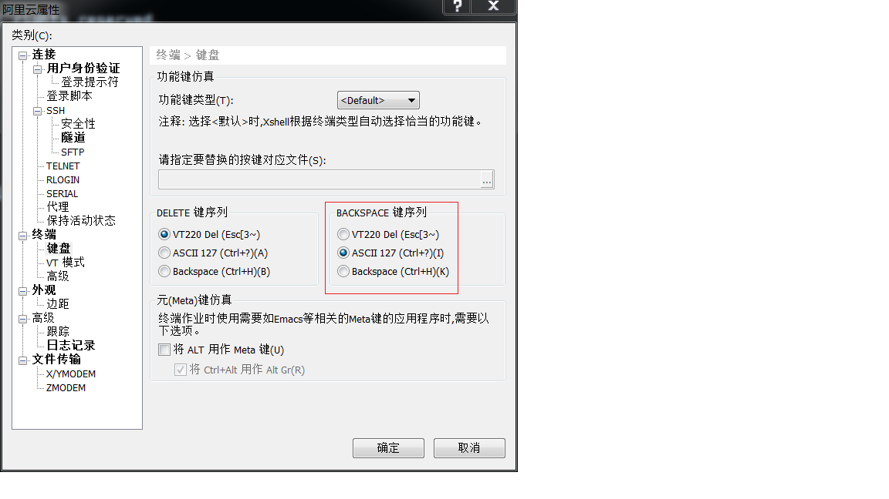

原文：[Vim 里如何映射 CTRL-h 为 left ?](http://www.skywind.me/blog/archives/1857)

很多人习惯在配置文件中映射`ctrl+hjkl`为光标移动，却碰到了一些问题：
```vim
inoremap <c-h> <left>
inoremap <c-j> <down>
inoremap <c-k> <up>
inoremap <c-l> <right>
```
映射后无效或者映射以后按`<BS>`键不能删除，这是什么原因呢？

很简单，因为你的终端软件的默认配置是按下`<BS>`键以后
发送的是：`^H`（`ASCII`码`0x08`），而`^H`在你的`vim`里被你 `inoremap`成了`ctrl+h`，所以你按了`<BS>`会被认为按下了左键。

早在VT100终端时代，`^H`（`ASCII`码`0x08`）表示`<BS>`而`^?`（`ASCII`码`0x7f`）表示`<DEL>`。过去`0x7f`是留给`DELETE`键使用的。而到了VT220时代，`DELETE`已经变为`^[[3~`（`ASCII`码 `0x1b,0x5b,0x33,0x7e`共4个字节），而`^?`的`0x7f`换给了我们的`<BS>`，有些终端软件，默认`<BS>`还是使用VT100的`^H`，你需要做的就是改一下终端默认配置而已。

你可以在你服务端下面查看下默认的键位设置：
```bash
$ stty -a
```
现在所有Linux服务器的`erase`（`bs`）基本都是`^?`了（如果链接到非Linux老操作系统`erase`不是这个的话，需要改一下，可以在系统层改，也可以vim里面`set t_kb=…`），vim里面也是认可`^?`的，可有些终端软件却默认发送`^H`，不过好在他们都支持修改：


