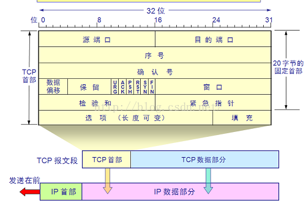
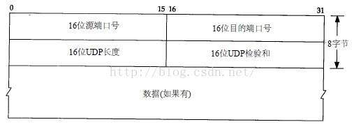

原文：[IP、TCP、UDP首部详解](http://blog.csdn.net/zhangliangzi/article/details/52554439)

### IP首部

**（1）第一个4字节（也就是第一行）**

1. 版本号（Version），4位；用于标识IP协议版本，IPv4是0100，IPv6是0110，也就是二进制的4和6。
2. 首部长度（Internet Header Length），4位；用于标识首部的长度，单位为4字节，所以首部长度最大值为：(2^4 - 1) * 4 = 60字节，但一般只推荐使用20字节的固定长度。
3. 服务类型（Type Of Service），8位；用于标识IP包的优先级，但现在并未使用。
4. 总长度（Total Length），16位；标识IP数据报的总长度，最大为：2^16 -1 = 65535字节。

**（2）第二个四字节**

1. 标识（Identification），16位；用于标识`IP`数据报，如果因为数据链路层帧数据段长度限制（也就是`MTU`，支持的最大传输单元），`IP`数据报需要进行分片发送，则每个分片的`IP`数据报标识都是一致的。
2. 标识（Flag），3位，但目前只有2位有意义；最低位为`MF`，`MF=1`代表后面还有分片的数据报，`MF=0`代表当前数据报已是最后的数据报。次低位为`DF`，`DF=1`代表不能分片，`DF=0`代表可以分片。
3. 片偏移（Fragment Offset），13位；代表某个分片在原始数据中的相对位置。

**（3）第三个四字节**

1. 生存时间（TTL），8位；以前代表`IP`数据报最大的生存时间，现在标识`IP`数据报可以经过的路由器数。
2. 协议（Protocol），8位；代表上层传输层协议的类型，1代表ICMP，2代表IGMP，6代表TCP，17代表UDP。
3. 校验和（Header Checksum），16位；用于验证数据完整性，计算方法为，首先将校验和位置零，然后将每16位二进制反码求和即为校验和，最后写入校验和位置。

**（4）第四个四字节：源IP地址**

**（5）第五个四字节：目的IP地址**

### TCP首部

**（1）第一个4字节**

1. 源端口，16位；发送数据的源进程端口
2. 目的端口，16位；接收数据的进程端口

**（2）第二个4字节与第三个4字节**

1. 序号，32位；代表当前`TCP`数据段第一个字节占整个字节流的相对位置
2. 确认号，32位；代表接收端希望接收的数据序号，为上次接收到数据报的序号+1，当`ACK`标志位为1时才生效

**（3）第四个4字节**

1. 数据偏移，4位；实际代表`TCP`首部长度，最大为60字
2. 6个标志位，每个标志位1位：
    * SYN，为同步标志，用于数据同步
    * ACK，为确认序号，ACK=1时确认号才有效
    * FIN，为结束序号，用于发送端提出断开连接
    * URG，为紧急序号，URG=1是紧急指针有效
    * PSH，指示接收方立即将数据提交给应用层，而不是等待缓冲区满
    * RST，重置连接
3. 窗口值，16位；标识接收方可接受的数据字节数

**（4）第五个4字节**

1. 校验和，16位；用于检验数据完整性
2. 紧急指针，16位；只有当URG标识位为1时，紧急指针才有效。紧急指针的值与序号的相加值为紧急数据的最后一个字节位置。用于发送紧急数据

### UDP首部

