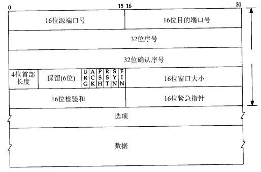

### TCP报文格式

* 16位源端口号与目的端口号：用于区别主机中的不同进程，而IP地址是用来区分不同的主机的，源端口号和目的端口号配合上IP首部中的源IP地址和目的IP地址就能唯一的确定一个TCP连接
* 32位序号：用来标识从TCP发送端向TCP接收端发送的数据字节流，它表示在这个报文段中的的第一个数据字节在数据字节流中的偏移，主要用来解决网络报乱序的问题
* 32位确认序号：用作对另一方发送来的TCP报文段的响应。其值是收到的TCP报文段的序号值加1。不过，只有当标志位中的ACK标志为1时该确认序列号的字段才有效。主要用来解决不丢包的问题
* 4位首部长度：给出首部中32bit字的数目，这个字段占4bit，最多能表示15个32bit的的字，即4*15=60个字节的首部长度，因此TCP最多有60字节的首部，若不存在选项，则这个值为20字节
* 标志位：TCP首部中有6个标志位，它们中的多个可同时被设置为1，主要是用于操控TCP的状态机的，依次为URG，ACK，PSH，RST，SYN，FIN。每个标志位的意思如下：
     * URG：此标志表示TCP包的16位紧急指针是否有效，用来保证TCP连接不被中断，并且督促中间层设备要尽快处理这些数据
     * ACK：此标志表示32位确认序号是否有效，一般称携带ACK标志的TCP报文段为“确认报文段”
     * PSH：这个标志位表示Push操作。所谓Push操作就是指在数据包到达接收端以后，立即传送给应用程序，而不是在缓冲区中排队
     * RST：这个标志表示连接复位请求。用来复位那些产生错误的连接，也被用来拒绝错误和非法的数据包，一般称携带RST标志的TCP报文段为“复位报文段”
     * SYN：表示同步序号，请求建立一个连接，一般称携带SYN标志的TCP报文段为“同步报文段”
     * FIN：表示发送端已经达到数据末尾，也就是说双方的数据传送完成，没有数据可以传送了，发送FIN标志位的TCP数据包后，连接将被断开，一般称携带FIN标志的TCP报文段为“结束报文段”
* 16位窗口大小：是TCP流量控制的一个手段。这里说的窗口，指的是接收通告窗口。它告诉对方本端的TCP接收缓冲区还能容纳多少字节的数据，这样对方就可以控制发送数据的速度
* 16位校验和：发送端对TCP报文段执行CRC算法计算一个数值，接收端计算结果要与发送端完全一样，从而证明数据的有效性。该校验不仅包括TCP首部，也包括数据部分。这是一个强制性的字段，一定是由发送端计算和存储，并由接收端进行验证的
* 16位紧急指针：指向后面是紧急数据的字节，在URG标志设置为1时才有效。如果URG标志为0，紧急域作为填充

### TCP的连接与终止

 

其实，网络上的传输是没有连接的，包括TCP也是一样的。而TCP所谓的“连接”，其实只不过是在通讯的双方维护一个“连接状态”，让它看上去好像有连接一样。所以，TCP的状态变换是非常重要的。

#### TCP三次握手

对于建立链接的3次握手，主要是要初始化Sequence Number的初始值。通信的双方要互相通知对方自己的初始化的Sequence Number（缩写为ISN：Inital Sequence Number），所以叫SYN，全称Synchronize Sequence Numbers。也就上图中的x和y。这个号要作为以后的数据通信的序号，以保证应用层接收到的数据不会因为网络上的传输的问题而乱序（TCP会用这个序号来拼接数据）。

简单来说，就是

1. 建立连接时，客户端发送SYN包（SYN=i）到服务器，并进入到SYN-SEND状态，等待服务器确认
2. 服务器收到SYN包，必须确认客户的SYN（ack=i+1）,同时自己也发送一个SYN包（SYN=k）,即SYN+ACK包，此时服务器进入SYN-RECV状态
3. 客户端收到服务器的SYN+ACK包，向服务器发送确认报ACK（ack=k+1）,此包发送完毕，客户端和服务器进入ESTABLISHED状态，完成三次握手

**为什么要三次握手?**

为了防止已失效的连接请求报文段突然又传送到了服务端，因而产生错误。例如如下情况：

client发出的第一个连接请求报文段并没有丢失，而是在某个网络结点长时间的滞留了，以致延误到连接释放以后的某个时间才到达server。本来这是一个早已失效的报文段。但server收到此失效的连接请求报文段后，就误认为是client再次发出的一个新的连接请求。于是就向client发出确认报文段，同意建立连接。假设不采用“三次握手”，那么只要server发出确认，新的连接就建立了。由于现在client并没有发出建立连接的请求，因此不会理睬server的确认，也不会向server发送数据。但server却以为新的运输连接已经建立，并一直等待client发来数据。这样，server的很多资源就白白浪费掉了。采用“三次握手”的办法可以防止上述现象发生。例如刚才那种情况，client不会向server的确认发出确认。server由于收不到确认，就知道client并没有要求建立连接。

#### TCP四次挥手

由于TCP连接时是全双工的，因此每个方向都必须单独进行关闭。这一原则是当一方完成数据发送任务后，发送一个FIN来终止这一方向的链接。收到一个FIN只是意味着这一方向上没有数据流动，既不会再收到数据，但是在这个TCP连接上仍然能够发送数据，直到这一方向也发送了FIN，首先进行关闭的一方将执行主动关闭，而另一方则执行被动关闭。

服务端在LISTEN状态下，收到建立连接请求的SYN报文后，把ACK和SYN放在一个报文里发送给客户端。而关闭连接时，当收到对方的FIN 报文时，仅仅表示对方不再发送数据了但是还能接收数据，己方也未必全部数据都发送给对方了，所以己方可以立即close，也可以发送一些数据给对方后，再发送FIN报文给对方来表示同意现在关闭连接，因此，己方ACK和FIN一般都会分开发送。

简单来说就是

1. 客户端A发送一个FIN，用来关闭客户A到服务器B的数据传送
2. 服务器B收到这个FIN，它发回一个ACK，确认序号为收到的序号加1。和SYN一样，一个FIN将占用一个序号
3. 服务器B关闭与客户端A的连接，发送一个FIN给客户端A
4. 客户端A发回ACK报文确认，并将确认序号设置为收到序号加1

A在进入到TIME-WAIT状态后，并不会马上释放TCP，必须经过时间等待计时器设置的时间2MSL（最长报文段寿命），A才进入到CLOSED状态。为什么？

* 保证TCP协议的全双工连接能够可靠关闭
* 保证这次连接的重复数据段从网络中消失

先说第一点，如果Client直接CLOSED了，那么由于IP协议的不可靠性或者是其它网络原因，导致Server没有收到Client最后回复的ACK。那么Server就会在超时之后继续发送FIN，此时由于Client已经CLOSED了，就找不到与重发的FIN对应的连接，最后Server就会收到RST而不是ACK，Server就会以为是连接错误把问题报告给高层。这样的情况虽然不会造成数据丢失，但是却导致TCP协议不符合可靠连接的要求。所以，Client不是直接进入CLOSED，而是要保持TIME_WAIT，当再次收到FIN的时候，能够保证对方收到ACK，最后正确的关闭连接。

再说第二点，如果Client直接CLOSED，然后又再向Server发起一个新连接，我们不能保证这个新连接与刚关闭的连接的端口号是不同的。也就是说有可能新连接和老连接的端口号是相同的。一般来说不会发生什么问题，但是还是有特殊情况出现：假设新连接和已经关闭的老连接端口号是一样的，如果前一次连接的某些数据仍然滞留在网络中，这些延迟数据在建立新连接之后才到达Server，由于新连接和老连接的端口号是一样的，又因为TCP协议判断不同连接的依据是socket pair，于是，TCP协议就认为那个延迟的数据是属于新连接的，这样就和真正的新连接的数据包发生混淆了。所以TCP连接还要在TIME_WAIT状态等待2倍MSL，这样可以保证本次连接的所有数据都从网络中消失。

**为什么要四次挥手?**

TCP协议是一种面向连接的、可靠的、基于字节流的运输层通信协议。TCP是全双工模式，这就意味着，当主机1发出FIN报文段时，只是表示主机1已经没有数据要发送了，主机1告诉主机2，它的数据已经全部发送完毕了；但是，这个时候主机1还是可以接受来自主机2的数据;当主机2返回ACK报文段时，表示它已经知道主机1没有数据发送了，但是主机2还是可以发送数据到主机1的；当主机2也发送了FIN报文段时，这个时候就表示主机2也没有数据要发送了，就会告诉主机1，我也没有数据要发送了，之后彼此就会中断这次TCP连接。

**参考链接**

[TCP协议深度解析](http://www.kuqin.com/shuoit/20141018/342719.html) 
[关于TCP协议，我想你应该懂了！](http://network.51cto.com/art/201411/456783.htm) 
[TCP协议详解（理论篇）](http://www.2cto.com/net/201208/149347.html) 
[TCP协议详解](http://www.jianshu.com/p/ef892323e68f) 
[TCP协议解析](http://www.cnblogs.com/Adoryn/p/4134981.html) 
[TCP/IP 协议详解内容总结](http://blog.jobbole.com/91841/)
