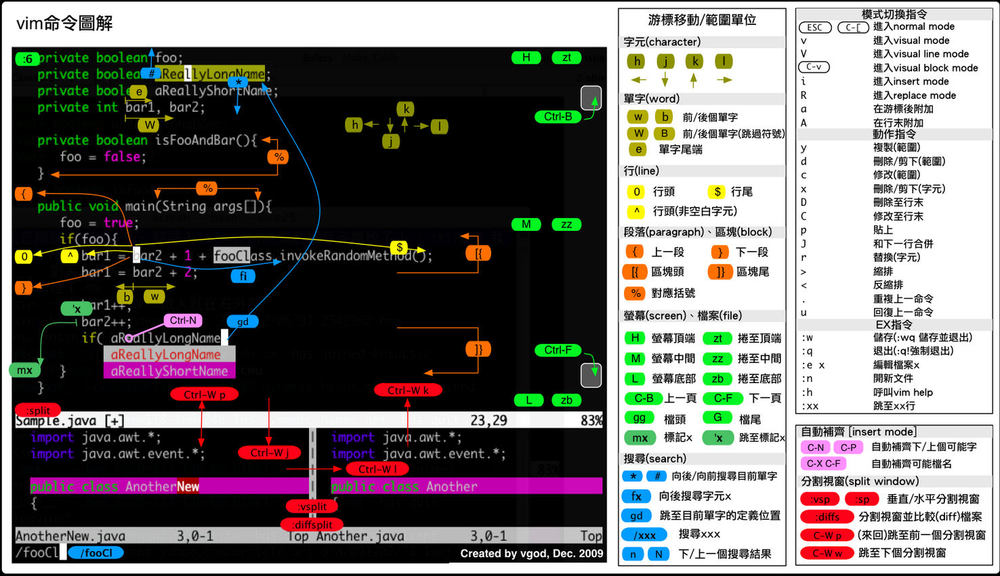

#### 文件操作

```bash
:new a.cpp  # 新建文件a.cpp
:e a.cpp  # 打开文件a.cpp（若不存在则新建）
:sp a.cpp  # 打开文件a.cpp（水平分割窗口）
:vsp a.cpp  # 打开文件a.cpp（垂直分割窗口）
:w  # 保存文件
:w a.cpp  # 保存为文件a.cpp
:q  # 退出编辑器
:q!  # 退出编辑器，且不保存
:wq  # 退出编辑器，且保存文件
```

#### 文件目录

```bash
[Shift]+r  # 刷新文件列表
```

#### 设置行号

```bash
:set nu  # 显示行号
:set nonu  # 取消显示行号
```

#### 切换回shell

```bash
:shell  # 切换到shell，此时vim在后台运行
exit  # 在shell中输入命令exit，切换回vim
```

#### 移动光标

```bash
h,j,k,l  # 控制光标的左下上右移动，也可以使用方向键或鼠标
5+  # 向下跳5行
3-  # 向上跳3行
3G  # 跳到行号为3的行
G  # 跳到最后一行
```

#### 删除（剪切）

```bash
x,X  # x为删除当前字符
     # X为向左删除一个字符
5x,3X  # 5x为删除从光标开始的5个字符
       # 3X为向左删除3个字符
dd  # 删除当前行
D  # 删除从光标开始的当前行的所有字符
2dd  # 向下删除包括当前行的2行
d5G  # 删除当前行（包括）与第5行（包括）之间所有数据
dG  # 删除当前行（包括）到最后一行（包括）的所有数据
d3j  # 删除当前行与向下3行的所有数据
```

#### 复制与粘贴

```bash
yy  # 复制当前行
3yy  # 复制包括当前行在内的向下3行
y5G  # 复制当前行（包括）与第5行（包括）之间所有数据
yG  # 复制当前行（包括）到最后一行（包括）的所有数据
y3j  # 复制当前行与向下3行的所有数据
y^  # 复制从光标到行首的内容
y$  # 复制从光标到行尾的内容
```
```bash
p,P  # p为粘贴在光标后
     # P为粘贴在光标前
```
```bash
v,V  # visual模式，通过上下左右键选择光标“扫过”的所有字符
     # visual line 模式，通过上下键选择光标“扫过”的所有行
[Ctrl]+v  # visual block 模式，通过上下左右键选择一个矩形文本
y  # 复制在visual、visual line和visual block模式下选择的文本
d  # 剪切在visual、visual line和visual block模式下选择的文本
```

#### 搜索与替换

```bash
/atool  # 向光标下搜索atool字符串
?atool  # 向光标上搜索atool字符串
n  # 向下搜索前一个搜素动作
N  # 向上搜索前一个搜索动作
```
```bash
:s/old/new  # 用new替换行中首次出现的old
:s/old/new/g  # 用new替换行中所有的old
:1,5 s/old/new/g  # 用new替换从第1行到第5行里所有的old
:%s/old/new/g  # 用new替换当前文件里所有的old
```

#### 撤销与恢复

```bash
u  # 撤销上一步操作
U  # 撤销对当前行的所有操作
```
```bash
[Ctrl]+r  # 恢复撤销操作修改的内容
```

#### 插入与退出

```bash
a,A  # a为在当前光标位置的右边添加文本
     # A为在当前行的末尾位置添加文本
i,I  # i为在当前光标位置的左边添加文本
     # I为在当前行的开始处添加文本（非空字符的行首）
o,O  # o为在当前行的下面新建一行
     # O为在当前行的上面新建一行
r,R  # r为替换当前光标位置的文本
     # R为替换当前光标位置及后面的若干文本
J  # 合并光标所在行及下一行为一行
```
```bash
[Esc]  # 退出，回到一般模式
```

#### 命令图解



**参考链接**

[Linux下创建文本文件（vi/vim命令使用详解）](http://www.cnblogs.com/EasonJim/p/6169985.html)</br>
[Windows上使用VIM入门之文件操作](http://www.cnblogs.com/tambor/archive/2011/12/28/vim_rumen_file_edit.html)</br>
[VIM/VI基本命令](http://www.atool.org/vim.php)
