**第1步：** 打开matlab2013a，将目录选择为要转化的工程目录，并在指令窗口输入deploytool，弹出界面，其中Type中的Windows Standalone Application与Console Application都可以生成exe，区别在于Console Application生成的exe在打开时会弹出dos窗口，该窗口在程序出错时会显示错误信息，还有个作用就是如果需要手动输入参数时，比如每次定义a等于多少（在m文件里是 a=input('请输入一个数')），现在则可以通过dos窗口输入

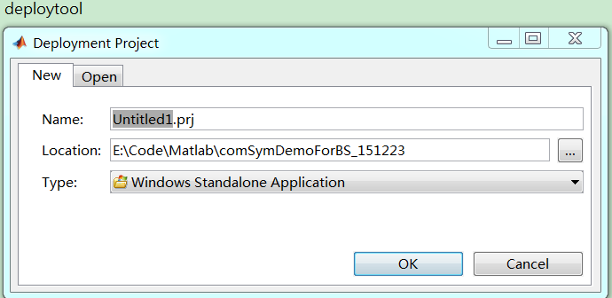

**第2步：** 先试试Console Application，OK

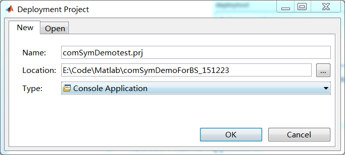

**第3步：** 通过1添加主程序m文件，在2中添加工程中的其他m文件或包含m文件的文件夹，如下图所示（若跳过2直接执行3，可能会报错，如本工程报错如下，原因是主程序中调用的函数GetParameters在封装时并没有封装工程中自己编的GetParameters函数，而是封装了matlab库中的一个同名的函数）

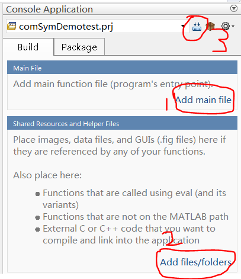 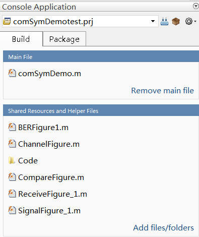 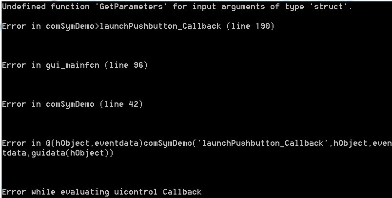

**第4步：** 生成exe成功后将工程中用到的文件拷贝到comSymDemotest\\distrib\\，运行成功！也可以在执行2时，将File文件夹添加进去，执行3，生成后也可以运行，不过这样会导致数据文件不可见，而且在界面上更改文件名会导致文件无法打开，故不提倡

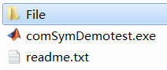 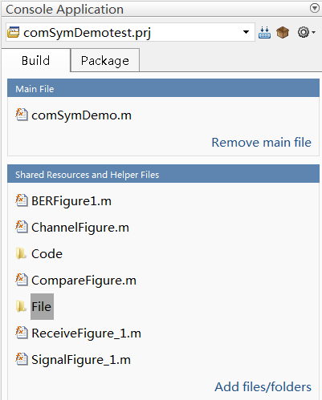 

**第5步：** 若程序成功运行，新建工程comSymDemo，选择Windows Standalone Application，OK

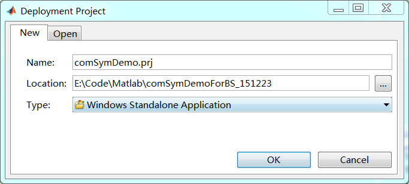

**第6步：** 下面的步骤和Console Application一样

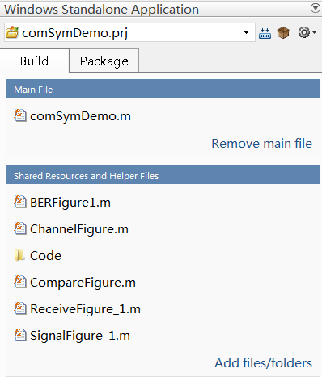

**第7步：** 若是想在没有安装matlab2013a的电脑上运行该exe，则选择Package中的Add MCR，OK并选择File文件夹，点击Package生成安装包

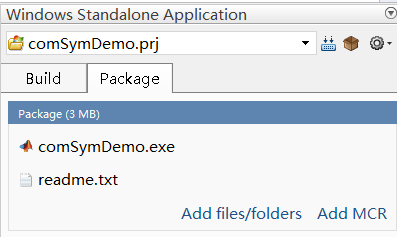 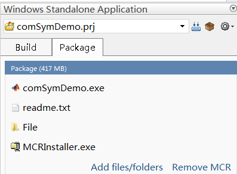 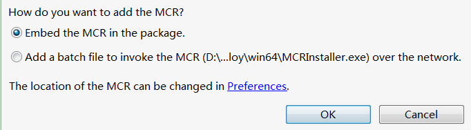
