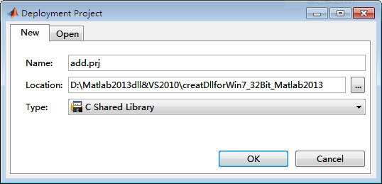
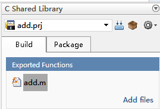
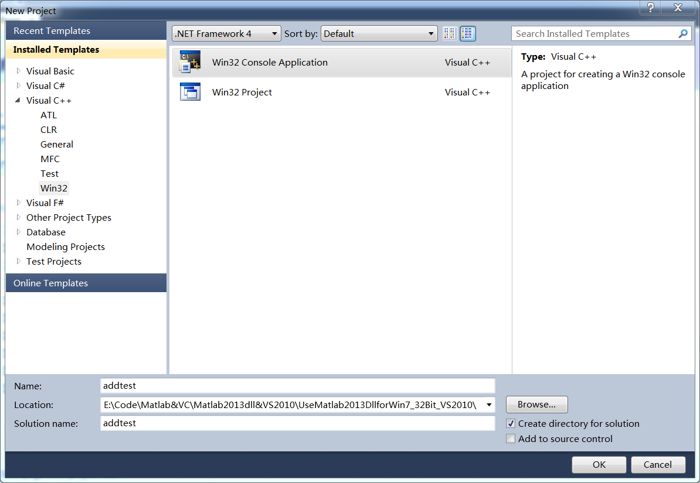
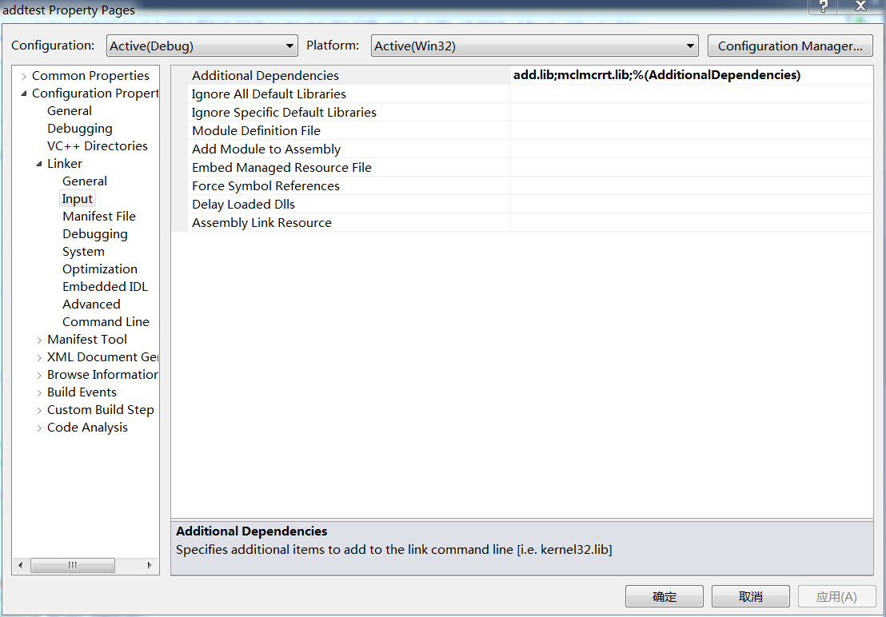
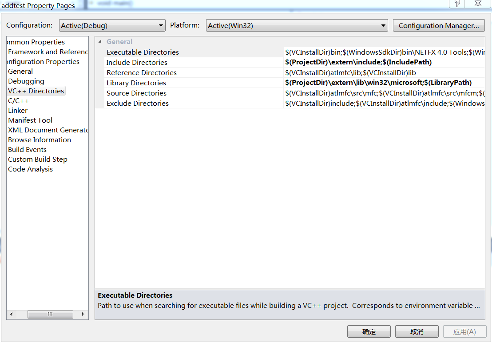

**第1步：** 打开Matlab2013a，新建add.m文件
```matlab
function data = add(a,b,count)
% a = 1;
% b = 2;
% count = 1000000000;
for nn = 1:count
    a = a+b;
end
data = a;
end
```

**第2步：** 在命令窗口依次输入mbuild –setup与mex –setup，都选择VS2010

**第3步：** 在此时可输入mcc –W lib:add –T link:lib add.m生成dll或输入deploytool，弹出图形界面如下，按图中设置之后，点击OK



**第4步：** 如下图所示，添加文件add.m，点击build



**第5步：** 打开VS2010，新建Win32 Console Application工程，名为addtest，选择empty project



**第6步：** 将Matlab2013a生成的add.h、add.lib、add.dll与其安装目录下的extern文件夹复制到工程目录下

**第7步：** 在工程中添加add.h，在Progect->Property->Configuration Properties->Linker->Input->Additional Dependencies下添加add.lib mclmcrrt.lib



**第8步：**  在Progect->Property->Configuration Properties->VC++ Directories（在VS2005中为Tools->Options->Projects and Solutions-> VC++ Directories）->Include Directories与Library Directories下添加路径如下图所示



**第9步：** 新建文件add.cpp，代码如下，编译并运行成功
```cpp
#include <iostream>
#include "add.h"
#include "mclmcr.h"

using namespace std;

void main()
{
	if(!mclInitializeApplication(NULL,0))  // hu 只用初始化一次
	{
		cout<<"初始化失败"<<endl;
		system("pause");
		return;
	}

	if(!addInitialize())            // hu 只用初始化一次
	{
		cout<<"初始化失败"<<endl;
		system("pause");
		return;
	}

	mxArray *MXa,
	        *MXb,
	        *MXcount;
	mxArray *MXdata = NULL;

	double a = 1,
		   b = 1,
		   count = 1E+9;
	double  *data;

	MXa = mxCreateDoubleMatrix(1,1,mxREAL);
	memcpy(mxGetPr(MXa),&a,1*sizeof(double));
	MXb = mxCreateDoubleMatrix(1,1,mxREAL);
	memcpy(mxGetPr(MXb),&b,1*sizeof(double));
	MXcount = mxCreateDoubleMatrix(1,1,mxREAL);
	memcpy(mxGetPr(MXcount),&count,1*sizeof(double));

	mlfAdd(1,&MXdata,MXa,MXb,MXcount);

	data = mxGetPr(MXdata);

	cout<<*data<<endl;
	system("pause");

	mxDestroyArray(MXdata);
	MXdata = 0;
	mxDestroyArray(MXa);
	MXa = 0;
	mxDestroyArray(MXb);
	MXb = 0;
	mxDestroyArray(MXcount);
	MXcount = 0;

	addTerminate();                 // hu 只用注销一次
	mclTerminateApplication();      // hu 只用注销一次
}
```
