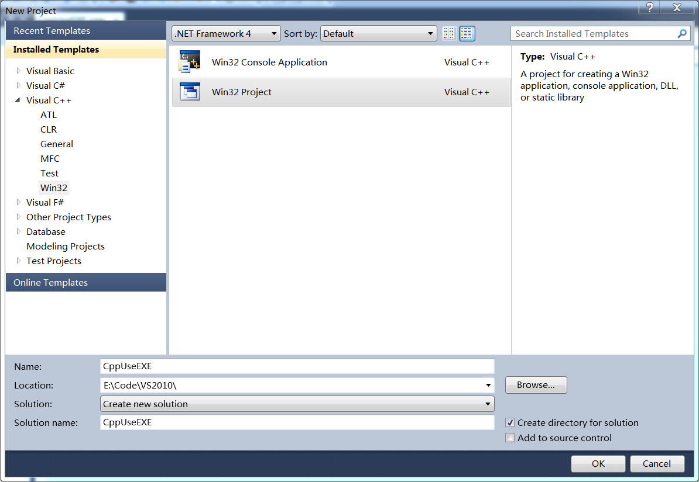

**第1步：** 新建工程，选择Empty Project，Finish



**第2步：** 新建cpp文件，并输入代码
```cpp
/*
 * 使用matlab生成的exe做加减运算（每次调用exe都会启动matlab引擎，比较花时间）
 */
#include <iostream>
using namespace std;

void main(){
	FILE *fp;
	int a,b,aaddb,aminusb;
	char status[20];

	cout<<"输入加数与被加数:"<<endl;
	cin>>a>>b;

	if ((fp=fopen("MatlabIn.txt","wt+")) == NULL){
		cout<<"打开文件MatlabIn.txt失败！"<<endl;
		return;
	}
	fprintf(fp,"a:%d\n",a); // hu 输入参数
	fprintf(fp,"b:%d\n",b);
	fclose(fp);

	if (fp=fopen("MatlabOut.txt","rt")){
		fclose(fp);
		remove("MatlabOut.txt");
	}

	system("addandminus.exe");  // hu 启动exe并等待其执行完退出

	if ((fp=fopen("MatlabOut.txt","rt")) == NULL){
		cout<<"打开文件MatlabOut.txt失败！"<<endl;
		return;
	}
	fscanf(fp,"status:%s\n",status);
	if (strcmp(status,"成功")){
		fclose(fp);
		cout<<status<<endl;
		return;
	}

	fscanf(fp,"a+b:%d\n",&aaddb);  // hu 获得结果
	fscanf(fp,"a-b:%d\n",&aminusb);
	fclose(fp);

	cout<<"aaddb:"<<aaddb<<"\naminusb:"<<aminusb<<endl;
	system("pause");
}
```

**第3步：** 启动matlab2013，新建Function文件，输入代码，并生成exe（Windows Standalone Application）
```matlab
% %
% 对MatlabIn.txt中的参数进行处理并输出到MatlabOut.txt
% %
function addandminus()
MatlabInfid = fopen('MatlabIn.txt','rt');
if MatlabInfid<0
    MatlabOutfid = fopen('MatlabOut.txt','wt+');
    fprintf(MatlabOutfid,'%s\n','status:打开MatlabIn.txt失败');
    fprintf(MatlabOutfid,'%s\n','a+b:');
    fprintf(MatlabOutfid,'%s\n','a-b:');
    fclose(MatlabOutfid);
    return;
end
a  = fscanf(MatlabInfid,'a:%d\n');
b  = fscanf(MatlabInfid,'b:%d\n');
fclose(MatlabInfid);

MatlabOutfid = fopen('MatlabOut.txt','wt+');
fprintf(MatlabOutfid,'%s\n','status:成功');
fprintf(MatlabOutfid,'a+b:%d\n',a+b);
fprintf(MatlabOutfid,'a-b:%d\n',a-b);
fclose(MatlabOutfid);
end
```

**第4步：** 将生成的exe文件复制到上面新建的vc工程目录下，运行vc程序成功！

**改进：** 上面的方法虽然能运行，但每次调用exe都要启动matlab引擎，比较花时间，可以将第2步和第3步代码加以改进
```cpp
/*
 * 使用matlab生成的exe做加减运算（exe一直处于运行状态，直到该程序发出退出命令）
 */
#include <iostream>
#include <windows.h>
#include <io.h>
using namespace std;

void main(){
	FILE *fp;
	int a,b,aaddb,aminusb;
	char status[20];

	WinExec("addandminus.exe",SW_HIDE);  // hu 启动matlab后直接执行下一步程序

	for (int ii=0;ii<5;ii++){
		cout<<"输入加数与被加数:"<<endl;
		cin>>a>>b;

		if ((fp=fopen("MatlabIn.txt","wt+")) == NULL){
			cout<<"打开文件MatlabIn.txt失败！"<<endl;
			return;
		}
		fprintf(fp,"a:%d\n",a);  // hu 输入参数
		fprintf(fp,"b:%d\n",b);
		fclose(fp);

		fclose(fopen("MatlabRun.tmp","a"));  // hu 执行matlab
		while(!access("MatlabRun.tmp",0));  // hu 该文件不存在说明matlab执行完成

		if ((fp=fopen("MatlabOut.txt","rt")) == NULL){
			cout<<"打开文件MatlabOut.txt失败！"<<endl;
			return;
		}
		fscanf(fp,"status:%s\n",status);
		if (strcmp(status,"成功")){
			fclose(fp);
			cout<<status<<endl;
			return;
		}

		fscanf(fp,"a+b:%d\n",&aaddb);
		fscanf(fp,"a-b:%d\n",&aminusb);
		fclose(fp);

		cout<<"aaddb:"<<aaddb<<"\naminusb:"<<aminusb<<endl;
	}

	fclose(fopen("MatlabStop.tmp","a"));  // hu 退出matlab
	system("pause");
}
```
```matlab
% %
% 每隔0.1s判断一次指令文件状态
% MatlabRun.tmp   对MatlabIn.txt中的参数进行处理并输出到MatlabOut.txt
% MatlabStop.tmp 退出程序
% %
function addandminus()
while 1
    pause(0.1);
    if exist('MatlabRun.tmp','file')   % hu 若该文件存在，执行程序

        MatlabInfid = fopen('MatlabIn.txt','rt');
        if MatlabInfid<0
            MatlabOutfid = fopen('MatlabOut.txt','wt+');
            fprintf(MatlabOutfid,'%s\n','status:打开MatlabIn.txt失败');
            fprintf(MatlabOutfid,'%s\n','a+b:');
            fprintf(MatlabOutfid,'%s\n','a-b:');
            fclose(MatlabOutfid);

            delete('MatlabRun.tmp');
            while exist('MatlabRun.tmp','file')
                delete('MatlabRun.tmp');
            end
            continue;
        end
        a  = fscanf(MatlabInfid,'a:%d\n');    % hu 获得输入参数
        b  = fscanf(MatlabInfid,'b:%d\n');
        fclose(MatlabInfid);

        MatlabOutfid = fopen('MatlabOut.txt','wt+');
        fprintf(MatlabOutfid,'%s\n','status:成功');
        fprintf(MatlabOutfid,'a+b:%d\n',a+b);   % hu 输出结果
        fprintf(MatlabOutfid,'a-b:%d\n',a-b);
        fclose(MatlabOutfid);

        delete('MatlabRun.tmp');   % hu 删除该文件表示程序运行完成
        while exist('MatlabRun.tmp','file')
            delete('MatlabRun.tmp');
        end
    elseif exist('MatlabStop.tmp','file')  % hu 若该文件存在，退出程序
        delete('MatlabStop.tmp');
        break;
    end
end
end
```
