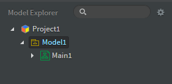
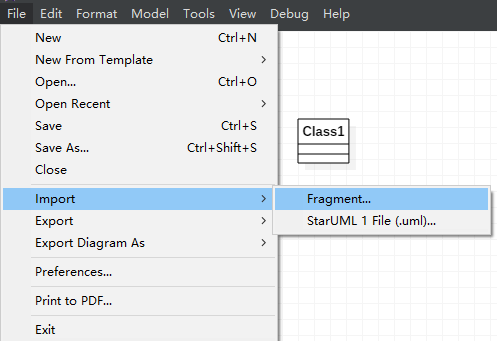
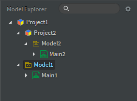
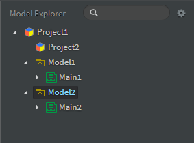
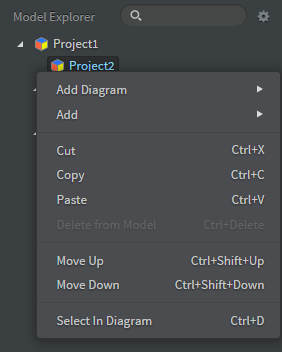
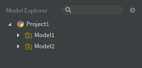

平时使用StartUML画类图或者时序图，有时想要将多个Project文件合并为一个文件，下图有两个Project文件


我们打开Project1，可以看到Project1里面包含一个Model



选择File->Import->Fragment，导入Project2文件



可以看到此时Project2位于Project1中



我们使用鼠标将Model2拖到Project1下面



此时Project2中已经没有Model，但我们无法将其删除



保存Project1文件并退出StartUML，使用Notepad打开Project1文件，可以看到文件里是一个json，删除其中`name`为`Project2`的对象，保存文件，关闭Notepad

```json
{
	"_type": "Project",
	"_id": "AAAAAAFF+h6SjaM2Hec=",
	"name": "Project1",
	"ownedElements": [
		{
			"_type": "UMLModel",
			"_id": "AAAAAAFF+qBWK6M3Z8Y=",
			"_parent": {
				"$ref": "AAAAAAFF+h6SjaM2Hec="
			},
			"name": "Model1",
			"ownedElements": [
                ...
			],
			"visibility": "public"
		},
		{
			"_type": "Project",
			"_id": "AAAAAAFj1cChHdGgCAU=",
			"_parent": {
				"$ref": "AAAAAAFF+h6SjaM2Hec="
			},
			"name": "Project2"
		},
		{
			"_type": "UMLModel",
			"_id": "AAAAAAFj1cChHdGfLdo=",
			"_parent": {
				"$ref": "AAAAAAFF+h6SjaM2Hec="
			},
			"name": "Model2",
			"ownedElements": [
                ...
			],
			"visibility": "public"
		}
	]
}
```

再使用StartUML打开Project1，可以看到Project2已经被删除了


