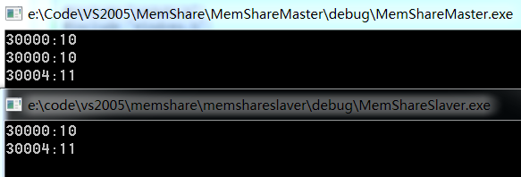

**第1步：** 新建控制台工程，主进程代码如下
```cpp
#include "stdafx.h"
#include "windows.h"

int _tmain(int argc, _TCHAR* argv[])
{
	wchar_t MemShareName[] = L"MemShareForTest";
	LPVOID pMemShare;
	int data = 10;

	//HANDLE hMap = ::OpenFileMapping(FILE_MAP_ALL_ACCESS,0,MemShareName);
	HANDLE hMap = ::CreateFileMapping(INVALID_HANDLE_VALUE,NULL,PAGE_READWRITE,0,128,MemShareName);  // hu 空间大小为Bytes
	pMemShare = ::MapViewOfFile(hMap,FILE_MAP_ALL_ACCESS,0,0,0);
	memcpy((int*)pMemShare,&data,sizeof(data));
	printf("%x:%d\n",(int*)pMemShare,*(int*)pMemShare);
	data++;
	memcpy((int*)pMemShare+1,&data,sizeof(data));
	printf("%x:%d\n",(int*)pMemShare,*(int*)pMemShare);
	printf("%x:%d\n",(int*)pMemShare+1,*((int*)pMemShare+1));

	getchar();

	::UnmapViewOfFile(pMemShare);
	::CloseHandle(hMap);

	return 0;
}
```
**第2步：** 新建控制台工程，从进程代码如下
```cpp
#include "stdafx.h"
#include "windows.h"

int _tmain(int argc, _TCHAR* argv[])
{
	wchar_t MemShareName[] = L"MemShareForTest";
	LPVOID pMemShare;

	HANDLE hMap = ::OpenFileMapping(FILE_MAP_ALL_ACCESS,0,MemShareName);
	pMemShare = ::MapViewOfFile(hMap,FILE_MAP_ALL_ACCESS,0,0,0);
	printf("%x:%d\n",(int*)pMemShare,*(int*)pMemShare);
	printf("%x:%d\n",(int*)pMemShare+1,*((int*)pMemShare+1));

	getchar();
	return 0;
}
```
**第3步：** 依次运行主从进程，结果如下


