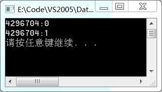
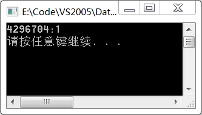

格式：
```cpp
#pragma comment(linker,"/section:MyData,rws")
#pragma data_seg("MyData")
   int g_iProNum = -1;
#pragma data_seg()
```
说明：

1. 以全局变量来定义，即函体之外；
2. 必需初始化，否则编译器会把未初始化的变量放到.BSS段中；
3. /SECTION:自己的数据段名,RWS，R为允许读，W为允许写，S为允许共享

**第1步：** 新建控制台程序，代码如下：
```cpp
#include "stdafx.h"
#include <iostream>

#pragma comment(linker,"/section:DataShare,rws")
#pragma data_seg("DataShare")
int g_ValueA = 0; // 全局变量，要赋值
#pragma data_seg()

int _tmain(int argc, _TCHAR* argv[])
{
	if (!g_ValueA)
	{
		printf("%d:%d\n",&g_ValueA,g_ValueA);
		g_ValueA=1;
	}
	printf("%d:%d\n",&g_ValueA,g_ValueA);
	system("pause");
	return 0;
}
```
**第2步：** 运行Debug中的exe，可以看到先后运行的两个exe数据的变化

 

**注意：** 进程间共享的是相同的物理地址，不同进程对应相同物理地址的虚拟地址并不相同，进程间不能共享指针，因为指针指向的是虚拟地址对应的数据，在另一进程中该虚拟地址并不指向原来的物理地址，例如
```cpp
#include "stdafx.h"
#include <iostream>

#pragma comment(linker,"/section:DataShare,rws")
#pragma data_seg("DataShare")
int *g_ValueA = NULL; // 全局变量，要赋值
#pragma data_seg()

int _tmain(int argc, _TCHAR* argv[])
{
	int a = 10;
	if (NULL == g_ValueA)
	{
		g_ValueA = &a;
		printf("%d:%d\n",g_ValueA,*g_ValueA);
		(*g_ValueA)++;
	}
	else
	{
		printf("%d:%d\n",g_ValueA,*g_ValueA);
	}
	system("pause");
	return 0;
}
```
该程序运行结果如下

 

这是由于第一进程中虚拟地址对应的物理空间a变为11，而第二进程收到的该虚拟地址对应的该进程的a还是等于10
