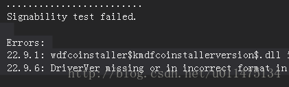
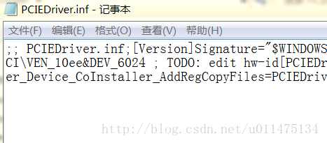
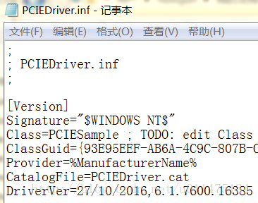

今天将自己的wdk项目上传到github，结果将项目下载到本地后却编译不通过，错误提示如下。



可是从github上克隆项目到本地却编译成功，最后排错发现问题出在inf文件上，对比两个inf文件发现，直接下载的项目里的inf文件的换行符没有了！！！最坑的是下载项目的inf文件用notepad或者vs打开是换行的。。。

下载的项目：



克隆的项目：



到这里，下载项目编译失败的原因很明显了，就是换行符的问题，百度找到一篇文章[《GitHub 第一坑：换行符自动转换》](http://blog.jobbole.com/46200/)。

原来，本地项目提交到github时会自动将Windows系统的换行符替换为Unix的换行符，从github上克隆项目到本地时会做相反的转换。而如果从github上直接下载项目的话，里面文件的换行符是Unix的，在Windows下以文本方式打开不能被识别。所以，这里只要关闭git的换行符自动转换功能就好了。

打开配置文件（github for windows的.gitconfig文件或者SourceTree的config文件），在[core]区段找到autocrlf，将它的值改为 false，如果在[core]区段找不到autocrlf，则在[core]区段添加
```
[core]
	autocrlf = false
```
重新上传项目，问题解决！
