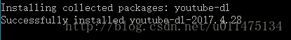
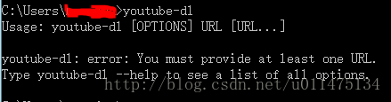
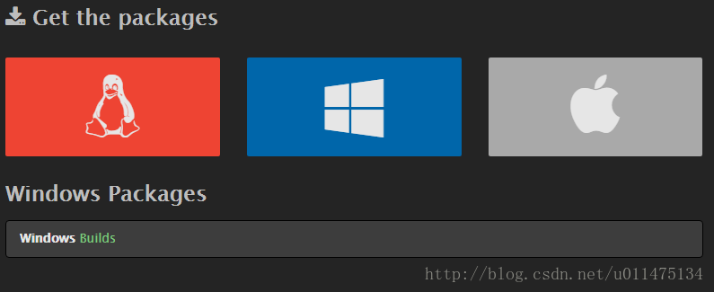
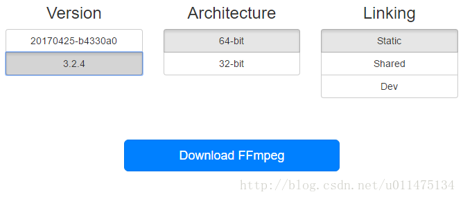
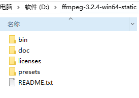
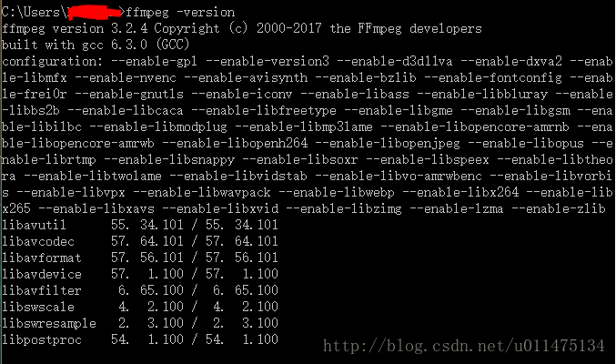
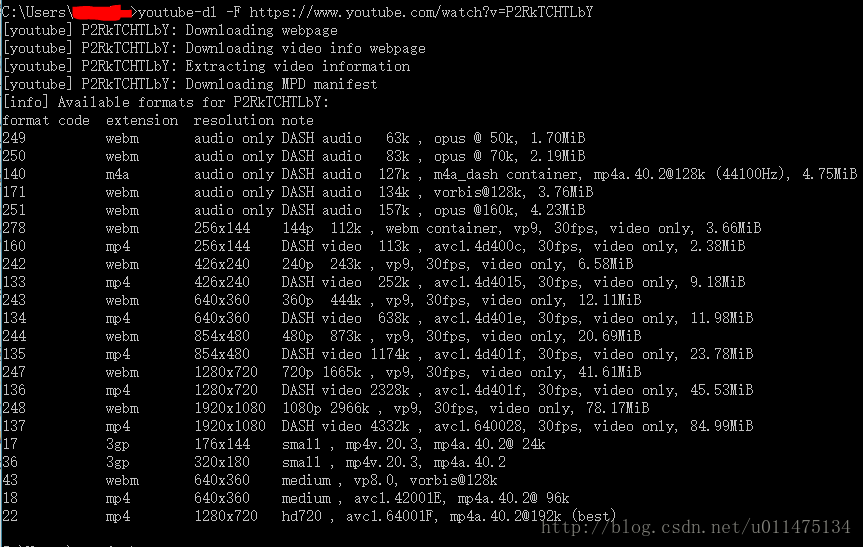
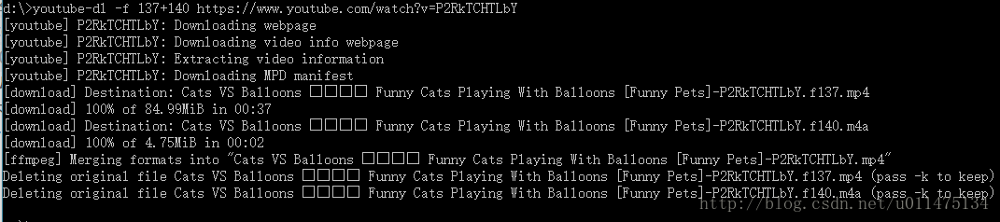
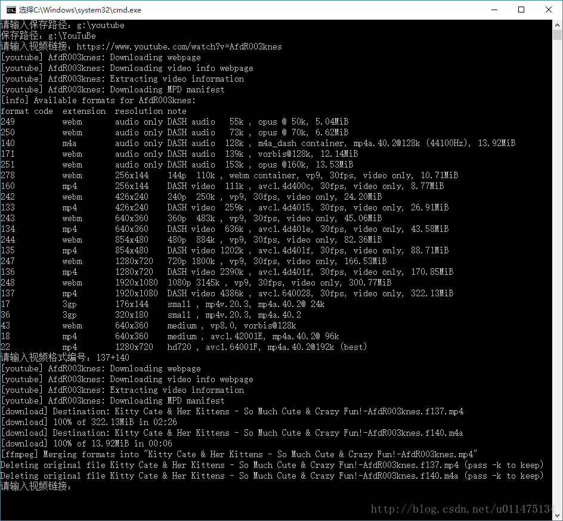

本文假定使用Win10操作系统，已安装好Python和Shadowsocks，并具备翻墙能力，另外，该方法在Win7下存在问题，视频下载不下来（[https://github.com/rg3/youtube-dl/issues/1901](https://github.com/rg3/youtube-dl/issues/1901)），如果有人知道解决方法，希望可以告知

**第1步：** WIN+R输入cmd，确定，输入pip install youtube-dl，回车，安装成功



也可输入youtube-dl验证，不过由于youtube上1080p及以上分辨率的视频和音频是分离的，所以还需要安装ffmpeg来将视频与音频进行合并，当然也可以用格式工厂，但是使用起来没有ffmpeg方便



**第2步：** 进入[ffmpeg下载页面](http://www.ffmpeg.org/download.html)，点击Windows Builds



由于我的电脑是64位，所以这里选择64-bit，Version选择3.2.4，Linking选择Static，点击Download FFmpeg下载



**第3步：** 下载完成后，将压缩包解压到D盘根目录



添加环境变量，右击我的电脑，选择属性-高级系统设置-高级-环境变量-系统变量-path，单击编辑，在最后输入;D:\ffmpeg-3.2.4-win64-static\bin，确定，重启系统，打开cmd，输入ffmpeg -version，安装成功如下图所示



**第4步：** 打开Shadowsocks，启用系统代理，系统代理模式设置为全局模式，打开cmd，输入youtube-dl -F youtube视频链接，回车，会显示该视频可以下载的视频格式与分辨率，如



可以看到，1080p的视频（如format code=137）显示为video only，即只有图像，没有声音，所以我们还要下载音频（fomat code=140），cmd输入d:，将当前目录切换到D盘根目录，输入youtube-dll -f 137+140 youtube视频链接，回车，下载的视频和音频会自动被ffmpeg合并保存到D盘根目录下，如果下载720p的视频（format code=22），可以看到并不需要单独下载音频文件，输入youtube-dll -f 22 youtube视频链接即可



**第5步：** 每次下载都要这样重复操作比较麻烦，我们可以写成bat文件，新建YouTuBe.bat
```
@echo off
:start
set /p dir=请输入保存路径：
set dir=%dir:/=\%
pushd %dir%
if /i not %dir%==%cd% goto :start
echo 保存路径：%cd%
:download
set /p input=请输入视频链接：
set input=%input:&=^^^&%
youtube-dl -F %input%
if errorlevel 1 goto :download
set /p code=请输入视频格式编号：
youtube-dl -f %code% %input%
goto :download
```
双击运行，按照提示输入保存路径、视频链接和format code，即可下载


