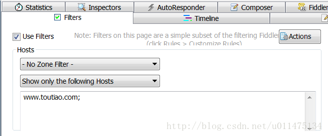
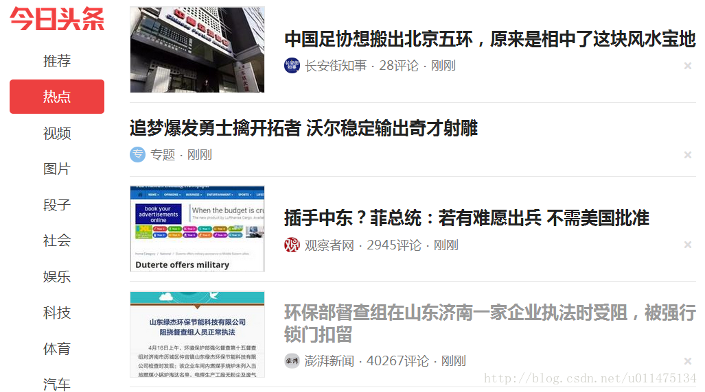

在上一篇文章[《使用python-aiohttp爬取网易云音乐》](http://blog.csdn.net/u011475134/article/details/70183360)中，我们给自己的微信公众号添加了在线点歌的功能，这次我们再增加一个新闻浏览的功能。由于我平时浏览新闻用的是今日头条，所以在这里就想通过爬取今日头条来获取新闻。不过遗憾的是，这一次我在网上没有找到满意的方法，所以还是自己动手吧。

打开抓包软件Fiddler并设置Filters。



打开今日头条网页，选择热点。
url：[http://www.toutiao.com/ch/news_hot/](http://www.toutiao.com/ch/news_hot/)



在Fiddler中找到与上面新闻对应的json数据与url，由于json数据太多，这里只给出部分。
```
{
    "has_more": false,
    "message": "success",
    "data": [
        {
            "chinese_tag": "体育",
            "media_avatar_url": "http://p3.pstatp.com/large/3538/9145332",
            "is_feed_ad": false,
            "tag_url": "news_sports",
            "title": "中国足协想搬出北京五环，原来是相中了这块风水宝地",
            "single_mode": true,
            "middle_mode": true,
            "abstract": "中国足协搬家的传说，很可能将水落石出。而且，此前的传说其实很靠谱，中国足协确实有意要从目前位于北京东城区夕照寺街的东玖大厦，搬到京城五环路以外。南海子虽然在北京五环外，但是紧邻南五环，距离位于体育馆路的国家体育总局也不过19公里。",
            "tag": "news_sports",
            "behot_time": 1492391171,
            "source_url": "/group/6409606379224957186/",
            "source": "长安街知事",
            "more_mode": false,
            "article_genre": "article",
            "image_url": "http://p3.pstatp.com/list/190x124/1bf4000b11da52a33c32",
            "has_gallery": false,
            "group_source": 2,
            "comments_count": 28,
            "group_id": "6409606379224957186",
            "media_url": "/c/user/4327876576/"
        },{},{},{},{},{},{}
    ],
    "next": {
        "max_behot_time": 1492391156
    }
}
```
可以看到，在json数据中的data是一个包含新闻的列表，其中的title是新闻的标题，abstract是新闻的摘要，source_url是新闻的链接，image_url是新闻图片的链接，这些都是我们需要的。
```
http://www.toutiao.com/api/pc/feed/?category=news_hot&utm_source=toutiao&widen=1&max_behot_time=0&max_behot_time_tmp=0&tadrequire=true&as=A135888F14A1507&cp=58F4A1A500177E1
```
| 参数 | 取值 | 说明 |
| -- | -- | -- |
|category          |news_hot       |类型，定值|
|utm_source        |toutiao        |定值|
|widen	           |1              |定值|
|max_behot_time    |0              |偏移量（默认为0）|
|max_behot_time_tmp|0              |与max_behot_time相等     |
|tadrequire        |true           |定值|
|as                |A135888F14A1507|未知|
|cp                |58F4A1A500177E1|未知|
通过多次观察发现，max_behot_time类似偏移量，点击热点时，取值为零，下拉网页时，取值为上一个josn数据中的next[max_behot_time]，由于点击热点就可以刷新新闻，所以让max_behot_time等于固定值0就好。

as和cp每次都会改变，但没有找到规律，推测应该是每次请求时，按照一定规律生成的数据，于是查看网页源码，很明显，下面这段代码就是用来产生as和cp的，从代码中可以看到，as和cp相当于一个时间戳，我们可以仿照这段代码用python来生成as和cp。
```
e.getHoney = function() {
    var t = Math.floor((new Date).getTime() / 1e3),
    e = t.toString(16).toUpperCase(),
    i = md5(t).toString().toUpperCase();
    if (8 != e.length) return {
        as: "479BB4B7254C150",
        cp: "7E0AC8874BB0985"
    };
    for (var n = i.slice(0, 5), a = i.slice( - 5), s = "", o = 0; 5 > o; o++) s += n[o] + e[o];
    for (var r = "",
    c = 0; 5 > c; c++) r += e[c + 3] + a[c];
    return {
        as: "A1" + s + e.slice( - 3),
        cp: e.slice(0, 3) + r + "E1"
    }
}
```

新建文件toutiao3.py并添加代码如下：

```
import asyncio
from aiohttp import ClientSession
import time
import math
import hashlib

__NEWS_NUM = 1  # hu 返回的最大新闻数

def getASCP():
	t = int(math.floor(time.time()))
	e = hex(t).upper()[2:]
	m = hashlib.md5()
	m.update(str(t).encode(encoding='utf-8'))
	i = m.hexdigest().upper()

	if len(e) != 8:
		AS = '479BB4B7254C150'
		CP = '7E0AC8874BB0985'
		return AS,CP

	n = i[0:5]
	a = i[-5:]
	s = ''
	r = ''
	for o in range(5):
		s += n[o] + e[o]
		r += e[o + 3] + a[o]

	AS = 'A1' + s + e[-3:]
	CP = e[0:3] + r + 'E1'
	return AS,CP

async def __fetch(url,data,loop):
	try:
		async with ClientSession(loop=loop) as session:
			# hu 发送GET请求，params为GET请求参数，字典类型
			async with session.get(url, params=data,timeout=5) as response:
				# hu 以json格式读取响应的body并返回字典类型
				return await response.json()
	except Exception as ex:
		print('__fetch:%s' % ex)

async def getNewsInfo(loop):
	global __NEWS_NUM
	AS,CP = getASCP()
	urlTouTiao = 'http://www.toutiao.com'
	urlNews = 'http://www.toutiao.com/api/pc/feed/'
	dataNew = {'category': 'news_hot',
			   'utm_source': 'toutiao',
			   'widen': '1',
			   'max_behot_time': '0',
			   'max_behot_time_tmp':'0',
			   'tadrequire':'true',
			   'as':AS,
			   'cp':CP}
	result = None
	try:
		task = asyncio.ensure_future(__fetch(urlNews, dataNew,loop),loop=loop)
		taskDone = await asyncio.wait_for(task,timeout=5)
		if 'message' not in taskDone or taskDone['message'] != 'success':
			return result

		result = {'max_behot_time':taskDone['next']['max_behot_time'],
				  'news':[]}

		for news_hot in taskDone['data']:
			news = {'Title': None,
					'Description': None,
					'PicUrl': None,
					'Url': None}
			# hu 去掉广告
			if news_hot['is_feed_ad']:
				continue
			news['Title'] = news_hot['title']
			if 'abstract' in news_hot:
				news['Description'] = news_hot['abstract']
			else:
				news['Description'] = ''
			if 'image_url' in news_hot:
				news['PicUrl'] = news_hot['image_url']
			else:
				news['PicUrl'] = ''
			news['Url'] = urlTouTiao + news_hot['source_url']
			result['news'].append(news)
			if len(result['news']) == __NEWS_NUM:
				break
		# hu 把有图片的新闻放到前面
		result['news'].sort(key=lambda obj: obj.get('PicUrl'), reverse=True)
	except Exception as ex:
		print('getNewsInfo:%s' % ex)
	return result

def __main():
	loop = asyncio.get_event_loop()
	for ii in range(2):
		task = asyncio.ensure_future(getNewsInfo(loop),loop=loop)
		taskDone = loop.run_until_complete(task)
		print('第%d次：' % ii)
		for res in taskDone['news']:
			print(res)
	loop.close()

if __name__ == '__main__':
	__main()
```
返回值：
```
第0次：
{'Title': '长沙现微型古籍 疑是明清科举作弊用书', 'Description': '', 'PicUrl': 'http://p3.pstatp.com/list/190x124/1bbf000b36c2b4f07ca0', 'Url': 'http://www.toutiao.com/group/6409737414201721090/'}
第1次：
{'Title': '长沙现微型古籍 疑是明清科举作弊用书', 'Description': '', 'PicUrl': 'http://p3.pstatp.com/list/190x124/1bbf000b36c2b4f07ca0', 'Url': 'http://www.toutiao.com/group/6409737414201721090/'}
```
结果每次获取的新闻都是一样的，通过Fiddler多次观察，发现新闻的刷新和Cookie中的tt_webid有关，当该参数不存在时，则返回默认新闻与tt_webid，所以我们只要取出响应中的tt_webid，并在发送请求时给tt_webid赋值就好。

**将toutiao3.py文件做如下修改：**
```
#### hu 增加代码 ######
__cookie = None
######################

async def __fetch(url,data,loop):
	global __cookie
	try:
		async with ClientSession(cookies=__cookie,loop=loop) as session:
			async with session.get(url, params=data,timeout=5) as response:
########################### hu 增加代码 ##############################
				if response.cookies and 'tt_webid' in response.cookies:
					__cookie = {'tt_webid':response.cookies['tt_webid'].value}
#####################################################################
				return await response.json()
	except Exception as ex:
		print('__fetch:%s' % ex)
```
返回值：
```
第0次：
{'Title': '长沙现微型古籍 疑是明清科举作弊用书', 'Description': '', 'PicUrl': 'http://p3.pstatp.com/list/190x124/1bbf000b36c2b4f07ca0', 'Url': 'http://www.toutiao.com/group/6409737414201721090/'}
第1次：
{'Title': '陈羽凡设立投资13家公司 3家被吊销营业执照', 'Description': '[海峡都市报-海峡网]（原标题：陈羽凡商业版图冰火两极）4月16日，歌手陈羽凡率先发声，通过视频正式澄清已与白百何协议离婚，并表示将无限期退出娱乐圈。一时之间，业内外开始对陈羽凡退出娱乐圈以后将何去何从进行诸多揣测。', 'PicUrl': 'http://p1.pstatp.com/list/190x124/1bbd000c3eef588ea140', 'Url': 'http://www.toutiao.com/group/6409610618823590146/'}
```
可以看到两次返回的新闻不一样。关于asyncio模块的基本概念可参考[《使用python-aiohttp搭建微信公众平台》](http://blog.csdn.net/u011475134/article/details/70147484)，这里就不一一注释了。至于怎么将今日头条的功能添加到我们的微信公众号，可以参考[《使用python-aiohttp爬取网易云音乐》](http://blog.csdn.net/u011475134/article/details/70183360)，这里就不贴代码了。
#### 源码下载：https://github.com/SigalHu/WeiXin/
