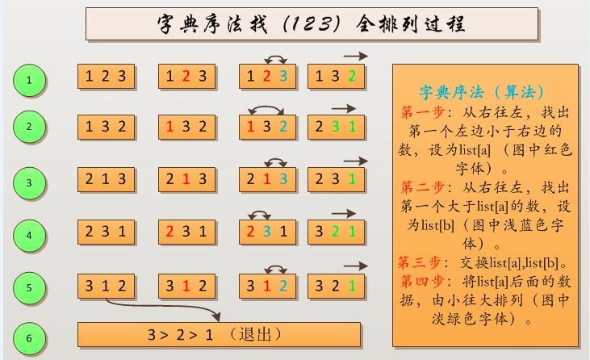

原文：[字典序算法](http://www.cnblogs.com/darklights/p/5285598.html)

我们先看一个例子。

示例： 1 2 3的全排列如下：

1 2 3 ， 1 3 2 ， 2 1 3 ， 2 3 1 ， 3 1 2 ， 3 2 1

我们这里是通过字典序法找出来的。

那么什么是字典序法呢？

从上面的全排列也可以看出来了，从左往右依次增大，对这就是字典序法。可是如何用算法来实现字典序法全排列呢？

我们再来看一段文字描述：（用字典序法找124653的下一个排列）

你主要看红色字体部分就行了，这就是步骤。

如果当前排列是124653,找它的下一个排列的方法是，从这个序列中从右至左找第一个左邻小于右邻的数，

如果找不到，则所有排列求解完成，如果找得到则说明排列未完成。

本例中将找到46,计4所在的位置为i,找到后不能直接将46位置互换，而又要从右到左到第一个比4大的数，

本例找到的数是5，其位置计为j，将i与j所在元素交换125643,

然后将i+1至最后一个元素从小到大排序得到125346，这就是124653的下一个排列。

下图是用字典序法找1 2 3的全排列（全过程）：



代码实现（C语言）：
```c
#include <stdio.h>
//交换list[a],list[b]
void Swap(int list[], int a, int b) {
    int temp = 0;
    temp = list[a];
    list[a] = list[b];
    list[b] = temp;
    return;
}
//将list区间[a,n]之间的数据由小到大排序
void Sort(int list[], int a, int n) {
    int temp = 0;
    for (int i = 1; i < n-a; ++i)
        for (int j = a+1; j < n-1; ++j)
            if (list[j] > list[j+1]) {
                temp = list[j];
                list[j] = list[j+1];
                list[j+1] = temp;
            }
    return;
}
//全排列
void Prim(int list[], int n) {
    int num = 1, a = 0, b = 0;
    for (int i = n; i > 0; --i)     //计算有多少种情况，就循环多少次
        num *= i;
    while (num--) {
        for (int i = 0; i < n; ++i) //打印情况
            printf("%d ",list[i]);
        printf("\n");

        for (int i = n-1; i > 0; --i) //从右往左，找出第一个左边小于右边的数，设为list[a]
            if (list[i-1] < list[i]) {
                a = i-1;
                break;
            }
        for (int j = n-1; j > a; --j) //从右往左，找出第一个大于list[a]的数，设为list[b]
            if (list[j] > list[a]) {
                b = j;
                break;
            }
        Swap(list, a, b);         //交换list[a],list[b]
        Sort(list, a, n);         //将list[a]后面的数据，由小往大排列
    }
    return;
}
//主函数
int main() {
    int list[] = {1,2,3,4};
    Prim(list,3);
    return 0;
}
```
