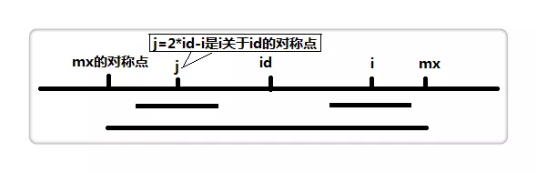
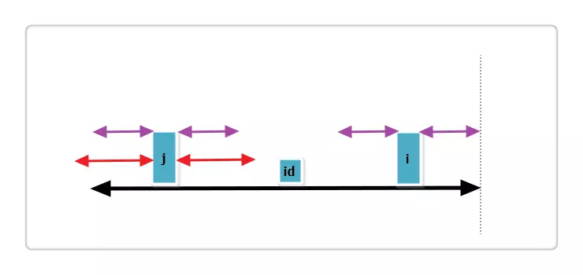
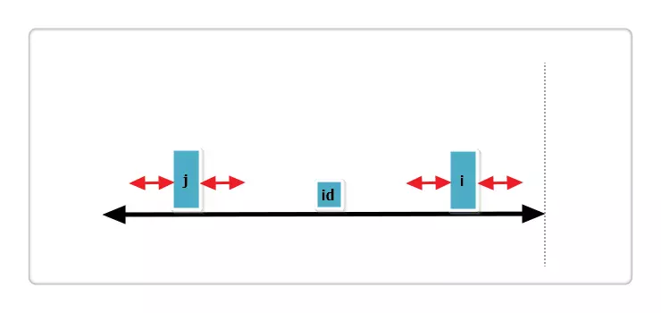
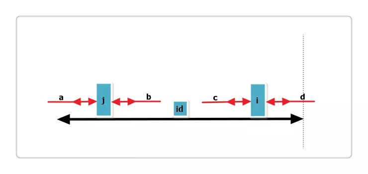
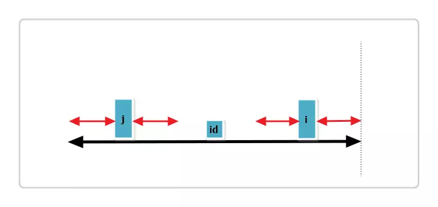

原文：[Manacher 算法](http://www.61mon.com/index.php/archives/181/)

### 背景

给定一个字符串，求出其最长回文子串。例如：
```cpp
s="abcd";   //最长回文长度为 1
s="ababa";  //最长回文长度为 5
s="abccb";  //最长回文长度为 4，即 bccb
```
以上问题的传统思路大概是，遍历每一个字符，以该字符为中点向两边查找。其时间复杂度为$O(n^2)$，很不高效。而`Manacher`算法可以把时间复杂度提升到$O(n)$。

### 算法过程分析

由于回文分为偶回文（比如`bccb`）和奇回文（比如`bcacb`），而在处理奇偶问题上会比较繁琐，所以这里我们使用一个技巧，具体做法是，在字符串首尾，及字符间各插入一个字符（前提这个字符未出现在串里）。

举个例子：`s="abbahopxpo"`，转换为`s_new="#a#b#b#a#h#o#p#x#p#o#"`。如此，`s`里起初有一个偶回文`abba`和一个奇回文`opxpo`，被转换为`#a#b#b#a#`和`#o#p#x#p#o#`，长度都转换成了奇数。

定义一个辅助数组`int p[]`，其中`p[i]`表示以`i`为中心的最长回文的半径，例如：
| `i` |	0 |	1 |	2 |	3 |	4 |	5 |	6 |	7 |	8 |	9 |	10 |	11 |	12 |	13 |	14 |	15 |	16 |	17 |	18 |
| :--: | -- | -- | -- | -- | -- | -- | -- | -- | -- | -- | -- | -- | -- | -- | -- | -- | -- | -- | -- |
| `s_new[i]` |	# |	a |	# |	b |	# |	b |	# |	a |	# |	h |	# |	o |	# |	p |	# |	x |	# |	p |	# |
| `p[i]` |	1 |	2 |	1 |	2 |	5 |	2 |	1 |	2 |	1 |	2 |	1 |	2 |	1 |	2 |	1 |	4 |	1 |	2 |	1 |
可以看出，**`p[i] - 1`正好是原字符串中最长回文串的长度。**

接下来的重点就是求解`p`数组，如下图：



设置两个变量`mx,id`。`mx`代表以`id`为中心的最长回文的右边界，也就是`mx = id + p[id]`。假设我们现在求`p[i]`，也就是以`i`为中心的最长回文半径，如果`i < mx`，则`p[i]`的值可基于以下三种情况得出：

#### 1. `j`的回文串有一部分在`id`的之外



上图中，黑线为`id`的回文，`i,j`关于`id`对称，红线为`j`的回文。此时`p[i] = mx - i`，即紫线。那么`p[i]`还可以更大么？答案是不可能！见下图：


假设右侧新增的紫色部分是`p[i]`可以增加的部分，那么根据回文的性质，`a == d` ，也就是说`id`的回文不仅仅是黑线，而是黑线+两条紫线，矛盾，所以假设不成立，故`p[i] = mx - i`，不可以再增加一分。

#### 2. `j`回文串全部在`id`的内部



此时`p[i] = p[j]`，那么`p[i]`还可以更大么？答案亦是不可能！见下图：



假设右侧新增的红色部分是`p[i]`可以增加的部分，那么根据回文的性质，`a == b`，也就是说`j`的回文应该再加上`a,b`，矛盾，所以假设不成立，故`p[i] = p[j]`，也不可以再增加一分。

#### 3. `j`回文串左端正好与`id`的回文串左端重合



根据代码，此时`p[i] = p[j]`或`p[i] = mx - i`，并且`p[i]`还可以继续增加。

### 代码实现
```cpp
#include <string>
#include <vector>
using namespace std;

// Manacher 算法
// 功能：给定一个字符串，求它的最长回文子串长度
int manacher(string str) {
    int max_loc = str.size() * 2;

    // 初始化字符串
    string s_new(max_loc + 1, '#');
    for (int ii = str.size() - 1; ii >= 0; --ii) {
        s_new[2 * ii + 1] = str[ii];
    }

    // 遍历字符串
    vector<int> p(max_loc + 1, 1);
    int max_len = 1;
    for (int ii = 1, jj, id = 0, mx = 1; ii < s_new.size(); ++ii) {
        if (ii - id >= mx) {
            for (; ii + p[ii] < s_new.size() && ii - p[ii] >= 0; ++p[ii]) {
                if (s_new[ii + p[ii]] != s_new[ii - p[ii]])
                    break;
            }
            id = ii;
            mx = p[ii];
            max_len = max(mx, max_len);
        } else {
            jj = id - (ii - id);
            if (jj - p[jj] == id - mx) {
                for (p[ii] = id + mx - ii; ii + p[ii] < s_new.size() && ii - p[ii] >= 0; ++p[ii]) {
                    if (s_new[ii + p[ii]] != s_new[ii - p[ii]])
                        break;
                }
                id = ii;
                mx = p[ii];
                max_len = max(mx, max_len);
            } else if (jj - p[jj] < id - mx) {
                p[ii] = id + mx - ii;
            } else {
                p[ii] = p[jj];
            }
        }
    }
    return max_len - 1;
}
```
